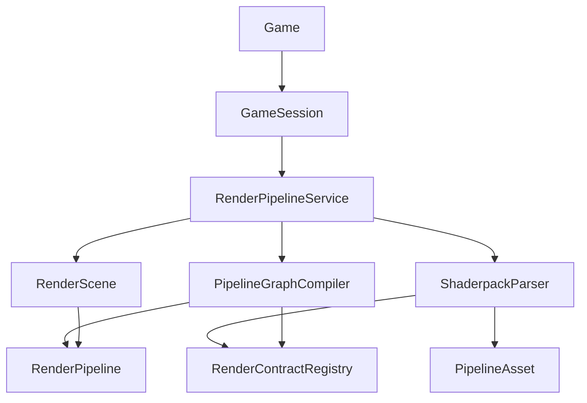

# Game 类职责重构方案

> 适用时机：完成当前渲染管线重构、`RenderScene` 成为唯一渲染入口、`Game::renderFrame()` 不再直接驱动 legacy `Renderer` 后执行。
> 目标：将 `Game` 从“会话上帝类”收敛为轻量的 Gameplay 会话协调器，减少跨模块耦合，提高后续玩法、UI、音频、调试、可编辑渲染管线和光影包扩展能力。

---

## 背景

当前 `Game` 已经从早期主循环中拆出一部分职责：

- `GameManager` 负责外层窗口、资源、音频、UI renderer 初始化和 app state 主循环。
- `GameplayAppState` 负责进入/退出 gameplay，并按 fixed update / render 两个阶段驱动 `Game`。
- `GameplayScene` 承接 ECS、fixed update、game tick 和 gameplay services。
- `RenderScene` 正在承接渲染管线编排。

但 `Game` 仍然直接持有并编排过多具体系统：`World`、`PhysicsSystem`、`Renderer`、`RenderScene`、`DropRenderer`、`FirstPersonHeldItemRenderer`、`HumanoidRenderer`、`PostProcessRenderer`、`ParticleSystem`、`RainRenderer`、`DropSystem`、`CraftingSystem`、`GameplayScene`、`Dashboard` 等。

这使 `Game` 仍然有多个变化原因：

- 渲染管线变化会改 `Game`。
- ECS 组件结构变化会改 `Game`。
- UI/HUD 数据变化会改 `Game`。
- 音频监听器同步变化会改 `Game`。
- 调试面板指标变化会改 `Game`。
- 世界加载、出生点、测试实体生成变化也会改 `Game`。

本方案不抢当前渲染管线重构的工作面，作为渲染重构完成后的下一轮架构清理。

额外约束：渲染管线后续需要支持**可编辑 pipeline** 和**基于 Mecraft contracts 开发的光影包解析**。因此本方案要求 `Game` 不直接理解 pipeline graph、pass contract、shaderpack manifest、shader directive、render target layout 等细节；这些能力必须归属渲染域服务，并通过稳定 facade 暴露给 gameplay/app 层。

---

## 总体设计目标

### 目标形态

`Game` 保留为 Gameplay 会话对象，但只负责高层生命周期和阶段调度：

```cpp
class Game {
public:
    explicit Game(GameSessionConfig config, GameSessionDependencies deps);

    void init();
    void shutdown();

    void fixedUpdate(double fixedStep, double& accumulator);
    void updateFrame(float deltaTime);
    void renderFrame(float deltaTime);

    bool isQuitToMenuRequested() const;
    void clearQuitToMenuRequest();

private:
    GameSession m_session;
    GameFrameOrchestrator m_frameOrchestrator;
};
```

推荐收敛后的 `Game` 只依赖少量高层对象：

- `GameSession`：拥有 gameplay 会话内的长期对象。
- `GameFrameOrchestrator`：按阶段调用 update/render/audio/ui，不保存复杂业务状态。
- `IGameplayView` 或 `GameplayPresentationSnapshot`：向 UI/渲染/音频提供只读快照。
- `RenderScene` 或 `IRenderSceneFacade`：唯一渲染入口。
- `IRenderPipelineService`：渲染配置、pipeline 选择、光影包应用的高层入口；`Game` 只调用能力，不解析资源。

---

## 六大原则映射

| 原则 | 当前问题 | 重构目标 |
|------|----------|----------|
| 单一职责原则 SRP | `Game` 同时负责对象创建、fixed update、ECS 查询、世界更新、渲染细节、后处理、UI 数据、音频监听器、调试指标 | `Game` 只负责 gameplay 会话生命周期；具体阶段交给专门协作者 |
| 开闭原则 OCP | 新增渲染路径、HUD 数据、天气渲染、调试视图时容易修改 `Game` | 新能力通过实现接口、扩展 snapshot builder 或注册系统接入，尽量不改 `Game` |
| 里氏替换原则 LSP | 缺少稳定抽象，`Game` 直接知道具体 renderer/system，无法替换实现 | 抽出面向调用方的窄接口，保证测试实现、空实现、真实实现可替换 |
| 接口隔离原则 ISP | `StateDependencies` 和 `Game` 依赖包偏胖，状态类容易获得过多系统权限 | 将依赖拆成小接口：输入、命令、世界交互、库存、UI 导航、音频事件等 |
| 依赖倒置原则 DIP | `Game` 直接依赖大量底层具体类和渲染实现细节 | `Game` 依赖高层抽象或 session facade，具体实现由组合根装配 |
| 迪米特法则 LoD | `Game` 穿透 ECS registry 查询组件，再把数据分发给 renderer/UI/audio | 用 facade/snapshot 隔离内部结构，`Game` 不直接认识组件细节和渲染资源细节 |

---

## 可编辑 Pipeline 与光影包支持

### 结论

本方案可以支持可编辑 pipeline 和光影包解析，但必须补充一条明确边界：

> `Game` 只能选择、切换、应用渲染配置；不能解析光影包、不能构建 pass graph、不能直接操作 render target contract。

也就是说，可编辑 pipeline 和光影包能力应落在渲染域内，由 `RenderScene` 之上的渲染服务或资源服务管理。`Game` 只拿到一个稳定的高层接口。

### 推荐渲染扩展层

建议在渲染管线完成后新增以下渲染域对象：

| 对象 | 职责 |
|------|------|
| `RenderPipelineService` | 管理当前 pipeline asset、当前光影包、热重载、错误状态、capability 查询 |
| `PipelineAsset` | 可编辑 pipeline 的数据模型，描述 pass graph、target 声明、资源依赖、执行顺序 |
| `PipelineGraphCompiler` | 将 `PipelineAsset` 编译为可执行的 `RenderPipeline` 或 `CompiledPipelineGraph` |
| `ShaderpackManifest` | 光影包入口描述：名称、版本、contracts 版本、pass 文件、默认设置、声明的 target/uniform/sampler |
| `ShaderpackParser` | 解析使用 Mecraft contracts 编写的光影包，并生成 `PipelineAsset`、`RenderSettings` 默认值和 shader binding 描述 |
| `RenderContractRegistry` | 管理 Mecraft contracts：target slot、uniform block、sampler binding、material layout、frame semantic |
| `RenderPipelineLibrary` | 注册 built-in forward/deferred/custom shaderpack pipelines，供 UI 或设置系统选择 |

`RenderScene` 仍然是每帧渲染入口，但不一定直接拥有所有解析逻辑。推荐关系：



### Game 可见接口

`Game` 或 `GameSession` 最多依赖以下窄接口：

```cpp
class IRenderPipelineService {
public:
    virtual ~IRenderPipelineService() = default;

    virtual void renderFrame(const RenderFrameRequest& request) = 0;
    virtual const RenderSettings& settings() const = 0;
    virtual void applySettings(const RenderSettings& settings) = 0;

    virtual bool selectPipeline(const std::string& pipelineId) = 0;
    virtual bool applyShaderpack(const std::string& shaderpackId) = 0;
    virtual RenderPipelineStatus status() const = 0;
};
```

其中 `RenderFrameRequest` 来自 `GameplayPresentationSnapshot`：

```cpp
struct RenderFrameRequest {
    World& world;
    Camera camera;
    Window& window;
    BlockTargetRenderData blockTarget;
    BlockBreakRenderData blockBreak;
    float frameTime = 0.0f;
};
```

注意：`RenderFrameRequest` 不包含 pass graph、GL texture handle、shader 文件路径、contract slot 等底层细节。

### 光影包解析边界

基于 Mecraft contracts 的光影包建议遵循以下输入输出：

输入：

- `shaderpack.json` 或等价 manifest。
- pass shader 文件。
- pipeline graph 描述。
- contract 版本声明。
- render target / sampler / uniform / material layout 声明。
- 默认 `RenderSettings` 或 pack options。

输出：

- `PipelineAsset`
- `RenderSettings` 默认值或 overrides
- `ShaderpackDirectives`
- shader 编译请求
- pass I/O contract
- capability 信息，例如是否需要 GBuffer、shadow、history、velocity、weather mask

`ShaderpackParser` 不应该依赖 `Game`、`GameplayScene`、`PlayerQuery` 或 UI 控件。它只依赖文件系统、资源管理、contract registry 和 shader compiler 相关服务。

### 可编辑 Pipeline 边界

可编辑 pipeline 的编辑器可能需要读取/修改 `PipelineAsset`，但不应该直接修改 `Game` 或 `RenderScene` 的私有状态。

推荐数据流：

1. 编辑器修改 `PipelineAsset`。
2. `PipelineGraphCompiler` 校验 pass I/O、target 格式、contract 版本、资源生命周期。
3. 编译成功后生成新的 `CompiledPipelineGraph`。
4. `RenderPipelineService` 原子切换当前 graph。
5. `RenderScene` 在下一帧使用新 graph，并根据 contract invalidation 规则清理 temporal/history 资源。

这与当前渲染重构中的 `FrameContext`、`FrameOutput`、`RenderSettings`、`RenderPipeline`、`RenderTargets::PassIO` 是兼容的。后续需要把现有静态 `PassIO` 表扩展为“内置 pipeline 的 contract 描述”，而不是只作为固定 deferred pipeline 的文档。

### 对六大原则的影响

| 原则 | 设计约束 |
|------|----------|
| SRP | 光影包解析、pipeline 编译、frame 渲染、gameplay session 分属不同对象 |
| OCP | 新增光影包或 pipeline graph 时注册 asset/compiler 输出，不改 `Game` |
| LSP | built-in pipeline、shaderpack pipeline、测试 pipeline 都实现同一渲染入口或 graph 执行接口 |
| ISP | UI/editor 使用 `IPipelineEditorService`，Game 使用 `IRenderPipelineService`，两者不共享胖接口 |
| DIP | `Game` 依赖渲染服务抽象；具体 parser/compiler/RenderPipeline 由渲染域组合 |
| LoD | `Game` 不知道 shaderpack manifest、pass 节点、target slot、sampler binding |

---

## 新架构分层

### 1. GameSession：会话对象聚合

职责：

- 拥有 gameplay 会话生命周期内的核心对象。
- 初始化世界、ECS、玩法服务、出生点。
- 暴露少量 facade 给 frame orchestrator 使用。

建议新增：

```cpp
class GameSession {
public:
    void init(const GameSessionConfig& config, const GameSessionDependencies& deps);
    void shutdown();

    World& world();
    ecs::GameplayScene& gameplayScene();
    GameStateMachine& stateMachine();
    CameraController& cameraController();
    GameplayPresentationBuilder& presentationBuilder();
};
```

迁移来源：

- `Game::initWorld()`
- `Game::initECS()`
- `Game::makeStateDependencies()`
- `World`、`PhysicsSystem`、`DropSystem`、`ParticleSystem`、`CraftingSystem`、`GameplayScene` 等会话内对象

原则收益：

- SRP：对象拥有和初始化从 `Game` 主流程剥离。
- DIP：`Game` 不直接知道所有底层服务。
- LoD：外部通过 `GameSession` facade 获取能力，不穿透内部对象图。

### 2. GameplayPresentationBuilder：统一快照构建

职责：

- 从 ECS / World / CameraController 中读取展示层需要的数据。
- 输出不可变快照，供 render、UI、audio 使用。
- 避免 `Game::renderFrame()` 多次直接 `PlayerQuery`、`reg.view` 和组件访问。

建议新增：

```cpp
struct GameplayPresentationSnapshot {
    Camera renderCamera;
    glm::vec3 eyePosition;
    bool renderLocalPlayerModel = false;
    bool eyeInWater = false;

    BlockTargetRenderData blockTarget;
    BlockBreakRenderData blockBreak;
    HeldItemPreviewMotion heldItemMotion;
    PlayerStatsData playerStats;

    const Inventory* inventory = nullptr;
    float fallRollRadians = 0.0f;
    int heldBlockLightLevel = 0;
};

class GameplayPresentationBuilder {
public:
    GameplayPresentationSnapshot build(float frameTime);
};
```

迁移来源：

- `Game::renderFrame()` 中相机构建逻辑
- fall roll 查询
- held block light 查询
- block target / block break 数据构建
- held item motion 构建
- player stats 构建

原则收益：

- SRP：展示数据构建独立。
- OCP：新增 HUD 字段或渲染展示字段时扩展 builder/snapshot，`Game` 主流程不扩散。
- LoD：`Game` 不再直接访问 ECS 组件结构。

### 3. GameFrameOrchestrator：阶段编排

职责：

- 串联 fixed update、frame update、render。
- 自身只调 facade，不实现具体业务。
- 负责 early return 和 quit-to-menu 检查。

建议新增：

```cpp
class GameFrameOrchestrator {
public:
    void fixedUpdate(GameSession& session, double fixedStep, double& accumulator);
    void updateFrame(GameSession& session, float deltaTime);
    void renderFrame(GameSession& session, float deltaTime);
};
```

迁移来源：

- `Game::runFixedUpdate()`
- `Game::syncAudioListener()`
- `Game::renderFrame()` 的高层顺序

原则收益：

- SRP：`Game` 从“执行所有细节”变成“持有会话并转发阶段”。
- OCP：阶段内部扩展不必修改 `Game` public API。

### 4. AudioListenerSyncSystem：音频监听器同步

职责：

- 同步 BGM、AudioEngine、listener position/orientation。
- 从 presentation snapshot 或 `IPlayerView` 读取只读数据。

建议新增：

```cpp
class AudioListenerSyncSystem {
public:
    void update(float deltaTime, const IPlayerView& playerView);
};
```

迁移来源：

- `Game::syncAudioListener()`

原则收益：

- SRP：音频监听器同步从 `Game` 剥离。
- DIP/LSP：未来可替换为 split-screen listener、spectator listener、测试空实现。

### 5. GameplayHudPresenter：HUD 数据与 UI 提交

职责：

- 将 `GameplayPresentationSnapshot` 转成 `UIRenderer` 所需输入。
- 调用 gameplay UI、state overlay、debug dashboard。

建议新增：

```cpp
class GameplayHudPresenter {
public:
    void render(const GameplayPresentationSnapshot& snapshot,
                const InputSnapshot& input,
                GameStateMachine& stateMachine);
};
```

迁移来源：

- `Game::renderUI()`
- debug `Dashboard` render 调用

原则收益：

- SRP：UI 呈现从渲染帧主流程分离。
- ISP：UI presenter 只需要 UI 相关依赖，不拿 World/Renderer 全家桶。

### 6. DebugFrameProfiler：调试指标独立

职责：

- 收集 fixed update / render / audio 等耗时。
- 生成 Dashboard 可消费的数据。
- release 构建中完全不参与主类字段膨胀。

迁移来源：

- `Game::FrameProfilerDebug`
- `Game::publishDebugFrameProfiler()`

原则收益：

- SRP：调试统计独立。
- OCP：新增指标不改 `Game`。

---

## 目标调用链

### Fixed update

```cpp
void Game::fixedUpdate(double fixedStep, double& accumulator) {
    m_frameOrchestrator.fixedUpdate(m_session, fixedStep, accumulator);
}
```

内部顺序：

1. `InputManager::update()`
2. `GameplayScene::runFixedUpdate()`
3. `GameTickClock` 推进离散 tick
4. `GameStateMachine::update()`
5. `World::update(playerPosition)`
6. profiler 记录

### Frame update

```cpp
void Game::updateFrame(float deltaTime) {
    m_frameOrchestrator.updateFrame(m_session, deltaTime);
}
```

内部顺序：

1. 更新 BGM 和 AudioEngine。
2. 从 player view / snapshot 同步 listener。
3. 处理非 fixed 的 session 级状态。

### Render frame

```cpp
void Game::renderFrame(float deltaTime) {
    m_frameOrchestrator.renderFrame(m_session, deltaTime);
}
```

内部顺序：

1. `GameplayPresentationBuilder::build(deltaTime)`
2. `RenderScene::renderFrame(world, snapshot.renderCamera, window, snapshot.blockTarget, snapshot.blockBreak)`
3. `GameplayHudPresenter::render(snapshot, input.snapshot(), stateMachine)`
4. `Window::swapBuffers()`

---

## 依赖设计

### GameSessionDependencies

替代当前偏过程式的 `GameInitParams`，区分配置和服务依赖：

```cpp
struct GameSessionConfig {
    int seed = 1234;
    int renderDistance = 16;
    glm::vec3 debugMobOffset = glm::vec3(5.0f, 0.0f, 0.0f);
};

struct GameSessionDependencies {
    Window& window;
    InputManager& input;
    ActionMap& actionMap;
    InputContextManager& contextManager;
    ResourceMgr& resourceMgr;
    AudioEngine& audioEngine;
    BgmSystem& bgmSystem;
    UIRenderer& uiRenderer;
    LocaleManager& localeManager;
};
```

后续进一步按 ISP 拆为：

- `InputServices`
- `RenderServices`
- `AudioServices`
- `LocalizationServices`
- `GameplayExternalServices`

### 小接口建议

为避免状态类和 presenter 直接依赖大对象，可逐步引入窄接口：

```cpp
class IPlayerView {
public:
    virtual ~IPlayerView() = default;
    virtual glm::vec3 eyePosition() const = 0;
    virtual glm::vec3 cameraFront() const = 0;
    virtual glm::vec3 cameraUp() const = 0;
    virtual bool eyesInWater() const = 0;
};

class IInventoryView {
public:
    virtual ~IInventoryView() = default;
    virtual const Inventory& inventory() const = 0;
};

class IGameplayCommandSink {
public:
    virtual ~IGameplayCommandSink() = default;
    virtual void requestQuitToMenu() = 0;
};
```

注意：不要一次性抽象所有系统。优先抽那些已经有替换需求、测试需求、或依赖过胖的问题点。

---

## 分阶段实施计划

### Phase G1：稳定边界，不改行为

目标：

- 新增 `GameSessionConfig` / `GameSessionDependencies`。
- 保留 `GameInitParams` 兼容层，内部转换为新结构。
- 不移动复杂逻辑，只先明确配置和依赖边界。

验收：

- 游戏可启动、进入 gameplay、返回主菜单。
- `Game` public API 不影响 `GameplayAppState`。

### Phase G2：提取 GameplayPresentationSnapshot

目标：

- 新增 `GameplayPresentationSnapshot`。
- 新增 `GameplayPresentationBuilder`。
- 将 `Game::renderFrame()` 中 ECS 展示数据查询迁移到 builder。

验收：

- `Game::renderFrame()` 不直接 `reg.view<LocalPlayerTag, ...>`。
- 方块选择框、破坏进度、手持物品摆动、HUD 数值保持一致。

### Phase G3：提取 HUD 和音频同步

目标：

- 新增 `GameplayHudPresenter`。
- 新增 `AudioListenerSyncSystem`。
- 删除 `Game::renderUI()` 和 `Game::syncAudioListener()` 内部业务细节。

验收：

- 暂停菜单、背包、命令输入、HUD、Dashboard 正常。
- BGM、脚步声、方块音效空间位置正常。

### Phase G4：提取 GameSession

目标：

- 将 `World`、`PhysicsSystem`、`GameplayScene`、`DropSystem`、`ParticleSystem`、`CraftingSystem` 等会话对象移动到 `GameSession`。
- `Game` 只拥有 `GameSession` 和少量 orchestrator/presenter。

验收：

- `Game.h` include 数显著下降，多数具体系统改为 `.cpp` 内部依赖。
- `Game` 构造函数不再直接解引用所有服务指针。

### Phase G5：提取 GameFrameOrchestrator

目标：

- 将 fixed update / frame update / render frame 顺序移入 orchestrator。
- `Game` 方法变为薄转发。

验收：

- `Game.cpp` 显著缩短。
- fixed update、game tick、world update 顺序与重构前一致。
- quit-to-menu 流程不变。

### Phase G6：接口隔离 StateDependencies

目标：

- 拆分 `StateDependencies`。
- GameplayState、InventoryState、CommandState 按需接收窄接口或专用 context。

建议拆分：

```cpp
struct GameplayStateContext;
struct InventoryStateContext;
struct CommandStateContext;
struct PauseStateContext;
```

验收：

- 每个 state 只包含实际使用的依赖。
- 删除未使用的大系统引用。

### Phase G7：Debug 独立和清理

目标：

- 提取 `DebugFrameProfiler`。
- Dashboard 通过 debug facade 获取数据。
- release 构建下 `Game` 不包含 dashboard/profiler 字段。

验收：

- Debug 面板指标正常。
- release 构建头文件依赖减少。

---

## 文件规划

建议新增：

| 文件 | 说明 |
|------|------|
| `src/game/session/GameSession.h/.cpp` | Gameplay 会话对象聚合和生命周期 |
| `src/game/session/GameSessionConfig.h` | 配置和依赖结构 |
| `src/game/session/GameFrameOrchestrator.h/.cpp` | fixed/update/render 阶段编排 |
| `src/game/presentation/GameplayPresentationSnapshot.h` | 展示层快照 |
| `src/game/presentation/GameplayPresentationBuilder.h/.cpp` | ECS/World 到 snapshot 的转换 |
| `src/game/presentation/GameplayHudPresenter.h/.cpp` | HUD/UI/state overlay/dashboard 提交 |
| `src/game/audio/AudioListenerSyncSystem.h/.cpp` | listener/BGM/audio update 同步 |
| `src/game/debug/DebugFrameProfiler.h/.cpp` | debug profiler，`MECRAFT_DEBUG` 下启用 |

建议修改：

| 文件 | 修改 |
|------|------|
| `src/game/Game.h/.cpp` | 收敛为薄会话 facade |
| `src/app/states/GameplayAppState.cpp` | 视情况从 `syncAudioListener()` 改为 `updateFrame()` |
| `src/game/states/StateDependencies.h` | 分阶段拆分为更小 context |
| `CMakeLists.txt` | 添加新增 `.cpp` |

---

## 风险与控制

| 风险 | 控制方式 |
|------|----------|
| fixed update 顺序改变导致玩法行为变化 | 每阶段只移动一个职责；迁移前后保留调用顺序注释；优先跑现有 gameplay/physics/input 测试 |
| snapshot 引入后出现旧帧数据 | snapshot 每帧一次性构建，只在本帧内传递；禁止长期保存裸指针，除 `Inventory` 等现有稳定引用外优先用值对象 |
| 抽象过度 | 只对跨边界、需要替换、测试困难的依赖引入接口；其余保持 concrete session 内部对象 |
| Debug 与 release 分支变复杂 | debug facade 独立文件，`Game` 只在 `.cpp` 局部使用条件编译 |
| 与渲染管线重构冲突 | 必须等 `RenderScene` 接管完整渲染后再开始；不再修改 legacy `Renderer` 调用路径 |

---

## 最终验收标准

- `Game.h` 不直接 include 具体 renderer、particle、drop、physics、world 细节头文件，优先前置声明或只包含 session facade。
- `Game.cpp` 不直接访问 ECS component view。
- `Game::renderFrame()` 不包含渲染管线分支、postprocess 参数组装、GBuffer/depth/weather mask 细节。
- `Game` public API 保持清晰：生命周期、fixed update、frame update、render、quit-to-menu。
- `StateDependencies` 被拆分，状态类不再默认拥有所有 gameplay 系统。
- 新增玩法系统、HUD 字段、渲染 debug view 时，原则上不需要修改 `Game`。

---

## 推荐执行顺序

1. 当前渲染管线重构完成并验收 Phase 11。
2. 执行 G1-G2，先消除 `Game::renderFrame()` 对 ECS 和展示数据的直接依赖。
3. 执行 G3，剥离 UI 和音频同步。
4. 执行 G4-G5，把 `Game` 收敛为真正的 session facade。
5. 执行 G6-G7，清理状态依赖和 debug 依赖。

该顺序优先减少当前最脆弱的跨层耦合，同时避免在渲染管线尚未完全收口前移动太多对象所有权。
