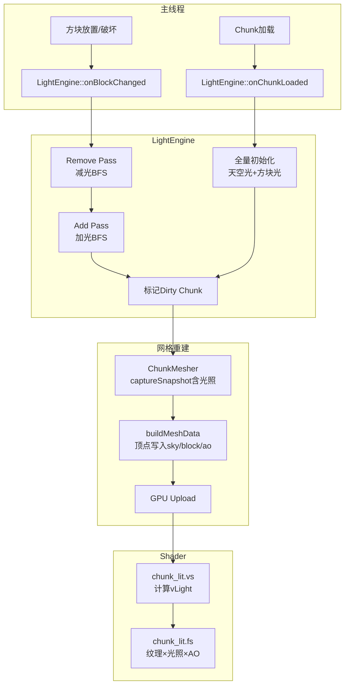

---

## Mecraft 高性能体素光照系统实现方案

### 一、现状分析

你的项目已经做了很好的光照基础设施准备：

| 已有部分 | 状态 |
|---------|------|
| `Chunk::m_lightMap` (high nibble=sky, low nibble=block) | ✅ 数据结构已就绪 |
| `getSunlight / setSunlight / getBlockLight / setBlockLight` | ✅ 读写接口已就绪 |
| `BlockDef::isLightSource / lightLevel / isTransparent / isSolid` | ✅ 方块属性已就绪 |
| `chunk_lit.vs / chunk_lit.fs` 光照 shader | ✅ 着色器已准备好 (aSunlight, aBlockLight, aAO) |
| 天空光列扫描 (`World::setBlock` 中) | ✅ 替换为LightEngine增量更新 |
| 地形生成时天空光初始化 | ✅ 已由 LightEngine onChunkLoaded 接管 |
| Block Light 传播 | ✅ 已实现 BFS 传播 |
| 增量传播 (增/减双 pass) | ✅ 已实现 |
| 跨 Chunk 边界传播 | ✅ 已实现边界预传播与世界坐标访问 |
| AO (Ambient Occlusion) | ✅ 已实现基于拓扑的顶点 AO 计算 |
| 光照异步化/性能调度 | ❌ 进行中 (Time-Slicing 优化) |
| `ChunkMesher` 将光照写入顶点 | ✅ BlockVertex 与 Mesher 已扩展并集成 |

### 二、核心架构设计

#### 2.1 整体数据流



#### 2.2 关键设计决策

**1) 天空光传播模型 —— "向下直射 + 侧向衰减BFS"**

这是 Minecraft 的核心光照模型：
- 天空光从 Y=255 顶部向下直射，遇到不透明方块阻断
- **水平方向**以 BFS 传播，每步衰减 1
- **向下方向**不衰减（保持天空光强度不变，直到被遮挡）
- 这就是为什么洞穴口会有光线渗入

```
天空光传播规则:
  从上方传入: 保持原值 (不衰减)
  从水平/下方传入: 减 1 (标准衰减)
  遇到不透明方块: 阻断
```

**2) Block Light 传播模型 —— 标准6邻域BFS**

- 光源方块注入 `lightLevel` 值
- 6邻域 BFS 传播，每步衰减 1
- 不透明方块阻断

**3) 增量更新 —— 增/减双pass**

这是正确性的关键。单做"加光"会导致残留亮点：

```
场景: 玩家在隧道中放一个火把，然后破坏它

只做Add Pass:
  放火把 → BFS传播 → 正确
  破坏火把 → 无减光 → 留下幽灵光 ❌

正确流程:
  破坏火把 → Remove Pass(清退受影响区域) → Add Pass(从剩余光源重灌) → 正确 ✅
```

### 三、详细实现方案

#### 3.1 Phase 0: 扩展 BlockVertex 与 ChunkMeshingSnapshot

**BlockVertex** 需要增加光照字段，与 `chunk_lit.vs` 的 layout 对齐：

```cpp
// 当前的 BlockVertex (7个float = 28 bytes)
struct BlockVertex {
    float x, y, z;       // location 0
    float u, v;          // location 1
    float normal;        // location 2
    float windWeight;    // location 3
    float layer;         // location 4
};

// 新增的 BlockVertex (10个float = 40 bytes)
struct BlockVertex {
    float x, y, z;       // location 0
    float u, v;          // location 1
    float normal;        // location 2
    float sunlight;      // location 3  (原 windWeight)
    float blockLight;    // location 4  (原 layer 的位置变化)
    float ao;            // location 5  (新增)
    float layer;         // location 6
};
```

> 注意：`windWeight` 字段目前仅用于植被摇摆，可以与光照字段协商复用或保留。建议按照 `chunk_lit.vs` 的 layout 重新安排字段顺序。

**ChunkMeshingSnapshot** 需要携带光照数据：

```cpp
struct ChunkMeshingSnapshot {
    std::array<BlockID, CHUNK_BLOCK_COUNT> blocks{};
    std::array<uint8_t, CHUNK_BLOCK_COUNT> lightMap{};  // 新增：与 Chunk::m_lightMap 相同打包方式

    // 边界方块 (已有)
    std::array<BlockID, ...> posXBorder{};
    std::array<BlockID, ...> negXBorder{};
    std::array<BlockID, ...> posZBorder{};
    std::array<BlockID, ...> negZBorder{};

    // 新增：边界光照
    std::array<uint8_t, ...> posXLightBorder{};
    std::array<uint8_t, ...> negXLightBorder{};
    std::array<uint8_t, ...> posZLightBorder{};
    std::array<uint8_t, ...> negZLightBorder{};
};
```

#### 3.2 Phase 1: LightEngine 核心类

```cpp
// LightEngine.h
#pragma once
#include <cstdint>
#include <vector>
#include <deque>
#include <unordered_set>

class Chunk;
class World;

// 光照类型
enum class LightKind : uint8_t {
    Sky   = 0,
    Block = 1
};

// BFS 节点
struct LightNode {
    int32_t x, y, z;
    uint8_t level;
};

// 轻量级位置 (用于去重集合)
struct LightPos {
    int32_t x, y, z;
    bool operator==(const LightPos& o) const { return x==o.x && y==o.y && z==o.z; }
};

struct LightPosHash {
    size_t operator()(const LightPos& p) const {
        // FNV-like hash
        size_t h = 14695981039346656037ULL;
        h ^= static_cast<size_t>(p.x); h *= 1099511628211ULL;
        h ^= static_cast<size_t>(p.y); h *= 1099511628211ULL;
        h ^= static_cast<size_t>(p.z); h *= 1099511628211ULL;
        return h;
    }
};

class LightEngine {
public:
    explicit LightEngine(World& world);

    // 区块加载时全量初始化
    void onChunkLoaded(Chunk& chunk);

    // 方块变化时增量更新
    void onBlockChanged(int wx, int wy, int wz,
                        uint8_t oldBlockId, uint8_t newBlockId);

private:
    World& m_world;

    // --- 天空光 ---
    void initSkyLight(Chunk& chunk);
    void propagateSkyLight(Chunk& chunk);
    void removeSkyLight(int wx, int wy, int wz);
    void spreadSkyLight(const std::vector<LightNode>& seeds);

    // --- 方块光 ---
    void initBlockLight(Chunk& chunk);
    void propagateBlockLight(Chunk& chunk);
    void removeBlockLight(int wx, int wy, int wz);
    void spreadBlockLight(const std::vector<LightNode>& seeds);

    // --- 通用 BFS ---
    std::deque<LightNode> m_queue;
    std::unordered_set<LightPos, LightPosHash> m_visited;

    // --- 辅助 ---
    uint8_t getSkyLight(int wx, int wy, int wz) const;
    uint8_t getBlockLight(int wx, int wy, int wz) const;
    void setSkyLight(int wx, int wy, int wz, uint8_t val);
    void setBlockLight(int wx, int wy, int wz, uint8_t val);
    bool isOpaque(int wx, int wy, int wz) const;
    uint8_t getOpacity(int wx, int wy, int wz) const;

    // heightMap 快照 (每 chunk)
    // 存储在 Chunk 内部更合理
};
```

#### 3.3 Phase 1: 天空光传播核心算法

```cpp
void LightEngine::initSkyLight(Chunk& chunk) {
    // Step 1: 列直射 - 从顶部向下扫描
    for (int z = 0; z < Chunk::SIZE_Z; ++z) {
        for (int x = 0; x < Chunk::SIZE_X; ++x) {
            bool openToSky = true;
            for (int y = Chunk::SIZE_Y - 1; y >= 0; --y) {
                if (openToSky) {
                    chunk.setSunlight(x, y, z, 15);
                } else {
                    chunk.setSunlight(x, y, z, 0);
                }
                if (BlockRegistry::get(chunk.getBlock(x, y, z)).isSolid) {
                    openToSky = false;
                }
            }
        }
    }

    // Step 2: 侧向BFS传播 - 处理洞穴/悬挑渗入
    propagateSkyLight(chunk);
}

void LightEngine::propagateSkyLight(Chunk& chunk) {
    std::vector<LightNode> seeds;

    // 收集所有天空光 > 0 的空气方块，其邻居可能需要更新
    for (int y = 0; y < Chunk::SIZE_Y; ++y) {
        for (int z = 0; z < Chunk::SIZE_Z; ++z) {
            for (int x = 0; x < Chunk::SIZE_X; ++x) {
                uint8_t sky = chunk.getSunlight(x, y, z);
                if (sky == 0) continue;
                if (BlockRegistry::get(chunk.getBlock(x, y, z)).isSolid) continue;

                int wx = chunk.m_chunkX * Chunk::SIZE_X + x;
                int wz = chunk.m_chunkZ * Chunk::SIZE_Z + z;

                // 检查6邻域是否需要传播
                static constexpr int dx[] = {1,-1,0,0,0,0};
                static constexpr int dy[] = {0,0,1,-1,0,0};
                static constexpr int dz[] = {0,0,0,0,1,-1};

                for (int d = 0; d < 6; ++d) {
                    int nx = x + dx[d], ny = y + dy[d], nz = z + dz[d];

                    // 计算传播目标应得的值
                    uint8_t propagated;
                    if (dy[d] == -1) {
                        // 向下传播：天空光不衰减
                        propagated = sky;
                    } else {
                        // 水平/向上传播：衰减1
                        propagated = (sky > 1) ? static_cast<uint8_t>(sky - 1) : 0;
                    }

                    if (propagated == 0) continue;

                    // 获取邻居当前值
                    uint8_t neighborSky;
                    if (nx >= 0 && nx < Chunk::SIZE_X &&
                        nz >= 0 && nz < Chunk::SIZE_Z &&
                        ny >= 0 && ny < Chunk::SIZE_Y) {
                        neighborSky = chunk.getSunlight(nx, ny, nz);
                    } else {
                        // 跨 chunk 访问
                        neighborSky = getSkyLight(wx + dx[d], ny, wz + dz[d]);
                    }

                    if (propagated > neighborSky) {
                        seeds.push_back({wx, y, wz, sky});
                        break; // 只需入队一次
                    }
                }
            }
        }
    }

    spreadSkyLight(seeds);
}

void LightEngine::spreadSkyLight(const std::vector<LightNode>& seeds) {
    m_queue.clear();
    m_visited.clear();

    for (const auto& s : seeds) {
        m_queue.push_back(s);
        m_visited.insert({s.x, s.y, s.z});
    }

    while (!m_queue.empty()) {
        LightNode cur = m_queue.front();
        m_queue.pop_front();

        uint8_t curSky = getSkyLight(cur.x, cur.y, cur.z);
        if (curSky == 0) continue; // 已被清除

        static constexpr int dx[] = {1,-1,0,0,0,0};
        static constexpr int dy[] = {0,0,1,-1,0,0};
        static constexpr int dz[] = {0,0,0,0,1,-1};

        for (int d = 0; d < 6; ++d) {
            int nx = cur.x + dx[d];
            int ny = cur.y + dy[d];
            int nz = cur.z + dz[d];

            if (ny < 0 || ny >= Chunk::SIZE_Y) continue;

            // 天空光传播的关键：向下不衰减
            uint8_t propagated;
            if (dy[d] == -1) {
                propagated = curSky;  // 向下：不衰减
            } else {
                propagated = (curSky > 1) ? static_cast<uint8_t>(curSky - 1) : 0;
            }
            if (propagated == 0) continue;

            // 检查目标是否不透明
            if (isOpaque(nx, ny, nz)) continue;

            uint8_t neighborSky = getSkyLight(nx, ny, nz);
            if (propagated > neighborSky) {
                setSkyLight(nx, ny, nz, propagated);
                LightPos pos{nx, ny, nz};
                if (m_visited.find(pos) == m_visited.end()) {
                    m_queue.push_back({nx, ny, nz, propagated});
                    m_visited.insert(pos);
                }
            }
        }
    }
}
```

#### 3.4 Phase 1: 增量更新（双Pass）

```cpp
void LightEngine::onBlockChanged(int wx, int wy, int wz,
                                  uint8_t oldBlockId, uint8_t newBlockId) {
    const BlockDef& oldDef = BlockRegistry::get(oldBlockId);
    const BlockDef& newDef = BlockRegistry::get(newBlockId);

    bool wasSolid = oldDef.isSolid;
    bool isSolid  = newDef.isSolid;
    bool wasLight = oldDef.isLightSource;
    bool isLight  = newDef.isLightSource;

    // === 天空光处理 ===

    if (wasSolid && !isSolid) {
        // 破坏了不透明方块 → 天空光可能进入
        // 设置当前位置天空光为15（如果上方敞开）
        uint8_t aboveSky = getSkyLight(wx, wy + 1, wz);
        if (wy + 1 >= Chunk::SIZE_Y) aboveSky = 15; // 顶部
        setSkyLight(wx, wy, wz, aboveSky);

        // 从当前位置向下传播天空光（不衰减）
        std::vector<LightNode> skySeeds;
        for (int y = wy - 1; y >= 0; --y) {
            if (isOpaque(wx, y, wz)) break;
            uint8_t target = aboveSky;
            if (getSkyLight(wx, y, wz) < target) {
                setSkyLight(wx, y, wz, target);
                skySeeds.push_back({wx, y, wz, target});
            }
        }

        // 侧向BFS
        if (aboveSky > 1) {
            skySeeds.push_back({wx, wy, wz, aboveSky});
        }
        spreadSkyLight(skySeeds);
    }
    else if (!wasSolid && isSolid) {
        // 放置了不透明方块 → 天空光被阻断
        // Remove Pass: 清退受影响区域的天空光
        removeSkyLight(wx, wy, wz);

        // 重新从这个位置的邻居回灌天空光
        std::vector<LightNode> skySeeds;
        static constexpr int dx[] = {1,-1,0,0};
        static constexpr int dz[] = {0,0,1,-1};

        for (int d = 0; d < 4; ++d) {
            uint8_t ns = getSkyLight(wx + dx[d], wy, wz + dz[d]);
            if (ns > 1) {
                skySeeds.push_back({wx + dx[d], wy, wz + dz[d], ns});
            }
        }
        // 上方
        uint8_t aboveSky = getSkyLight(wx, wy + 1, wz);
        if (aboveSky > 0) {
            skySeeds.push_back({wx, wy + 1, wz, aboveSky});
        }
        spreadSkyLight(skySeeds);
    }

    // === 方块光处理 ===

    if (wasLight && !isLight) {
        // 移除了光源 → Remove Pass
        removeBlockLight(wx, wy, wz);

        // Add Pass: 从邻居回灌
        std::vector<LightNode> blockSeeds;
        static constexpr int ddx[] = {1,-1,0,0,0,0};
        static constexpr int ddy[] = {0,0,1,-1,0,0};
        static constexpr int ddz[] = {0,0,0,0,1,-1};

        for (int d = 0; d < 6; ++d) {
            uint8_t nb = getBlockLight(wx + ddx[d], wy + ddy[d], wz + ddz[d]);
            if (nb > 1) {
                blockSeeds.push_back({wx + ddx[d], wy + ddy[d], wz + ddz[d], nb});
            }
        }
        spreadBlockLight(blockSeeds);
    }
    else if (isLight && !wasLight) {
        // 新增光源 → Add Pass
        uint8_t level = newDef.lightLevel;
        setBlockLight(wx, wy, wz, level);
        std::vector<LightNode> blockSeeds = {{wx, wy, wz, level}};
        spreadBlockLight(blockSeeds);
    }

    // 标记受影响的 chunk 为 dirty
    // ... (遍历传播波及的 chunk 并 markDirty)
}
```

#### 3.5 Phase 1: Remove Pass 实现

```cpp
void LightEngine::removeSkyLight(int wx, int wy, int wz) {
    // 当前位置的天空光清0
    uint8_t oldLevel = getSkyLight(wx, wy, wz);
    setSkyLight(wx, wy, wz, 0);

    // BFS: 找出所有"仅依赖此光源"的天空光节点
    std::deque<LightNode> removeQueue;
    std::vector<LightNode> reseedNodes;

    removeQueue.push_back({wx, wy, wz, oldLevel});

    while (!removeQueue.empty()) {
        LightNode cur = removeQueue.front();
        removeQueue.pop_front();

        static constexpr int dx[] = {1,-1,0,0,0,0};
        static constexpr int dy[] = {0,0,1,-1,0,0};
        static constexpr int dz[] = {0,0,0,0,1,-1};

        for (int d = 0; d < 6; ++d) {
            int nx = cur.x + dx[d];
            int ny = cur.y + dy[d];
            int nz = cur.z + dz[d];
            if (ny < 0 || ny >= Chunk::SIZE_Y) continue;
            if (isOpaque(nx, ny, nz)) continue;

            uint8_t neighborLevel = getSkyLight(nx, ny, nz);
            if (neighborLevel == 0) continue;

            // 计算当前节点能提供的值
            uint8_t provided;
            if (dy[d] == -1) {
                // 向下传播：检查 cur 是否能提供天空光给下方
                // 注意：被清除的节点cur的sky已经是0，所以这里
                // 需要判断邻居是否"依赖"cur
                provided = cur.level; // 用旧值
            } else {
                provided = (cur.level > 1) ? static_cast<uint8_t>(cur.level - 1) : 0;
            }

            // 如果邻居的光值刚好等于从cur传播过来的值，
            // 说明邻居可能仅依赖cur，需要被清除
            if (neighborLevel <= provided) {
                setSkyLight(nx, ny, nz, 0);
                removeQueue.push_back({nx, ny, nz, neighborLevel});
            } else {
                // 邻居有更强的来源，保留但加入 reseed
                reseedNodes.push_back({nx, ny, nz, neighborLevel});
            }
        }
    }

    // reseed: 从未被清除的高值节点重新传播
    spreadSkyLight(reseedNodes);
}

void LightEngine::removeBlockLight(int wx, int wy, int wz) {
    // 逻辑类似，但衰减规则不同（6邻域都衰减1）
    uint8_t oldLevel = getBlockLight(wx, wy, wz);
    setBlockLight(wx, wy, wz, 0);

    std::deque<LightNode> removeQueue;
    std::vector<LightNode> reseedNodes;

    removeQueue.push_back({wx, wy, wz, oldLevel});

    while (!removeQueue.empty()) {
        LightNode cur = removeQueue.front();
        removeQueue.pop_front();

        static constexpr int dx[] = {1,-1,0,0,0,0};
        static constexpr int dy[] = {0,0,1,-1,0,0};
        static constexpr int dz[] = {0,0,0,0,1,-1};

        for (int d = 0; d < 6; ++d) {
            int nx = cur.x + dx[d];
            int ny = cur.y + dy[d];
            int nz = cur.z + dz[d];
            if (ny < 0 || ny >= Chunk::SIZE_Y) continue;
            if (isOpaque(nx, ny, nz)) continue;

            uint8_t neighborLevel = getBlockLight(nx, ny, nz);
            if (neighborLevel == 0) continue;

            uint8_t provided = (cur.level > 1) ? static_cast<uint8_t>(cur.level - 1) : 0;

            if (neighborLevel <= provided) {
                setBlockLight(nx, ny, nz, 0);
                removeQueue.push_back({nx, ny, nz, neighborLevel});
            } else {
                reseedNodes.push_back({nx, ny, nz, neighborLevel});
            }
        }
    }

    spreadBlockLight(reseedNodes);
}
```

#### 3.6 Phase 1: 跨 Chunk 边界传播

关键在于 BFS 遍历时需要跨 Chunk 访问。你的项目已经有 `Chunk::neighbors[4]` 机制，可以直接复用：

```cpp
uint8_t LightEngine::getSkyLight(int wx, int wy, int wz) const {
    if (wy < 0 || wy >= Chunk::SIZE_Y) return 0;

    int cx, cz, lx, lz;
    // 世界坐标 → chunk坐标 + 本地坐标
    cx = static_cast<int>(std::floor(static_cast<float>(wx) / Chunk::SIZE_X));
    cz = static_cast<int>(std::floor(static_cast<float>(wz) / Chunk::SIZE_Z));
    lx = wx - cx * Chunk::SIZE_X;
    lz = wz - cz * Chunk::SIZE_Z;

    // 从 World 获取 chunk
    auto it = m_world.getActiveChunks().find(World::chunkKey(cx, cz));
    if (it != m_world.getActiveChunks().end()) {
        return it->second->getSunlight(lx, wy, lz);
    }
    return 0;
}
```

> 注意：`chunkKey` 目前是 private 的，需要暴露或在 LightEngine 中重复实现。

跨 Chunk 传播的完整流程：
1. BFS 在当前 Chunk 内正常执行
2. 当 BFS 到达 Chunk 边界时，通过 `neighbors[]` 指针或 World 查找继续
3. 如果邻居 Chunk 尚未加载，传播停止（邻居加载后会自己初始化）
4. 光照变化后，受影响的邻居 Chunk 也需要标记 dirty

#### 3.7 Phase 1: AO (Ambient Occlusion)

AO 计算在 `ChunkMesher` 中完成，不需要 BFS，纯粹基于邻居方块拓扑：

```cpp
// 为每个面的4个顶点计算AO值 (0-3)
uint8_t computeVertexAO(bool side1, bool side2, bool corner) {
    // 3个邻居决定AO:
    //   side1, side2: 面的两个边邻方块
    //   corner: 对角邻方块
    if (side1 && side2) return 0;  // 两边都遮挡 → 最暗
    return 3 - (side1 + side2 + corner);
}
```

在 `addFace` 中，对每个顶点计算它周围的3个邻居是否为不透明方块，得出 AO 值并写入顶点。

#### 3.8 Phase 1: ChunkMesher 集成

`ChunkMesher::addFace` 需要为每个顶点计算光照值：

```cpp
void ChunkMesher::addFace(std::vector<BlockVertex>& vertices,
                           const glm::vec3& pos, int face,
                           const BlockDef& def,
                           const ChunkMeshingSnapshot& snapshot,
                           int x, int y, int z) {
    // 获取面中心的光照值（取面朝向方向的邻居方块光照）
    uint8_t skyLight = getNeighborAwareSunLight(snapshot, x, y, z, face);
    uint8_t blockLight = getNeighborAwareBlockLight(snapshot, x, y, z, face);

    // 对每个顶点计算AO
    // ... (per-vertex AO calculation)

    for (const int index : indices) {
        vertices.push_back({
            pos.x + local.x, pos.y + local.y, pos.z + local.z,
            uvCoord.x, uvCoord.y,
            static_cast<float>(face),
            static_cast<float>(skyLight),
            static_cast<float>(blockLight),
            static_cast<float>(aoValue),
            layer
        });
    }
}
```

### 四、性能关键优化点

#### 4.1 HeightMap 加速天空光初始化

```cpp
// 在 Chunk 中新增:
uint16_t m_heightMap[16][16]; // 每列最高不透明方块的 Y 坐标

// 天空光列扫描: O(1) 判断某方块是否可见天空
bool canSeeSky(int x, int y, int z) const {
    return y >= m_heightMap[x][z];
}
```

这样 `World::setBlock` 中就不需要每次从 Y=255 扫到 Y=0，只需要更新受影响列的 heightMap 和天空光。

#### 4.2 BFS 队列优化

避免 `std::queue` 的高频小分配：

```cpp
// 方案1: 预分配 deque（已有）
std::deque<LightNode> m_queue;  // deque 比 queue<vector> 好

// 方案2: 预分配大数组 + 环形缓冲区（极致性能）
class LightBFSQueue {
    std::vector<LightNode> m_data;
    size_t m_head = 0, m_tail = 0;
public:
    LightBFSQueue() { m_data.resize(65536); }
    void push(LightNode n) { m_data[m_tail++ % m_data.size()] = n; }
    LightNode pop() { return m_data[m_head++ % m_data.size()]; }
    bool empty() const { return m_head == m_tail; }
};
```

#### 4.3 增量传播范围限制

BFS 设置最大访问节点数上限，防止单帧长尾：

```cpp
static constexpr int MAX_BFS_NODES_PER_UPDATE = 32768;

int visited = 0;
while (!m_queue.empty() && visited < MAX_BFS_NODES_PER_UPDATE) {
    // ... process
    ++visited;
}
// 如果未完成，将剩余节点留到下一帧
```

#### 4.4 跳过不透明方块

BFS 不进入不透明方块，大幅减少搜索空间。这一条已通过 `isOpaque` 检查实现。

#### 4.5 避免重复入队

使用 `m_visited` 集合，或者更轻量的方案——**写入时检查**：

```cpp
// 不用 visited 集合，而是靠"增亮写入"条件自然去重
if (propagated > neighborSky) {
    setSkyLight(nx, ny, nz, propagated);
    m_queue.push_back({nx, ny, nz, propagated});
    // 即使重复入队，由于 propagated 只会递减，
    // 二次处理时不会再传播（因为邻居已经更高）
}
```

这种方式在大多数情况下足够，且比维护 hash set 更快。

### 五、分阶段落地路线

```mermaid
gantt
    title Mecraft 光照系统开发计划
    dateFormat  YYYY-MM-DD
    section Phase 0 数据打底
    BlockVertex扩展 + Shader对接    :p0a, 2026-04-14, 1d
    BlockDef添加opacity字段         :p0b, 2026-04-14, 1d
    ChunkMeshingSnapshot添加光照     :p0c, 2026-04-15, 1d

    section Phase 1 单线程正确性
    LightEngine框架 + 天空光初始化   :p1a, 2026-04-16, 2d, done
    天空光增量传播(双pass)           :p1b, 2026-04-18, 2d, done
    Block Light传播                 :p1c, 2026-04-20, 2d, done
    跨Chunk边界传播                 :p1d, 2026-04-22, 2d, done
    AO实现 + Mesher集成             :p1e, 2026-04-24, 2d, done
    调试视图 + 回归测试             :p1f, 2026-04-26, 2d, done

    section Phase 2 性能调度与平滑
    主线程 Time-Slicing 队列        :p2a, 2026-04-28, 3d, active
    Tick预算控制断点续传            :p2b, 2026-05-01, 2d
    性能Profile + 调优              :p2c, 2026-05-03, 2d

    section Phase 3 渲染质量
    日夜循环skyIntensity            :p3a, 2026-05-05, 2d
    透明材质光照优化                :p3b, 2026-05-07, 2d
    平滑光照过渡(线性插值)          :p3c, 2026-05-09, 2d
```

### 六、与你现有代码的对接要点

1. **`World::setBlock`** — 当前已有的简单列扫描逻辑，应替换为调用 `LightEngine::onBlockChanged`
2. **`TerrainGenerator::generateChunk`** — 当前的列扫描天空光逻辑，改为在 `onChunkLoaded` 中统一初始化
3. **`Chunk::neighbors[4]`** — 已有，LightEngine 直接利用
4. **`ChunkMeshingService`** — 异步 meshing 已有，光照完成后 markDirty 即可触发重建
5. **`chunk_lit.vs / chunk_lit.fs`** — 已定义好 layout，只需 Mesher 端写入数据
6. **`BlockVertex`** — 需扩展字段，同时修改 `setupVertexLayout()` 中的 attribute 配置

### 七、首版建议的工作顺序

| 步骤 | 内容 | 预计改动量 |
|------|------|-----------|
| 1 | 修改 `BlockVertex`，添加 sunlight/blockLight/ao 字段 | 小 |
| 2 | 修改 `Chunk::setupVertexLayout()`，与 `chunk_lit.vs` layout 对齐 | 小 |
| 3 | 在 `Chunk` 中添加 `m_heightMap[16][16]` | 小 |
| 4 | 在 `BlockDef` 中添加 `opacity` 字段 | 小 |
| 5 | 实现 `LightEngine` 类（天空光初始化 + BFS + 增量双pass） | 大 |
| 6 | 修改 `ChunkMesher` 在顶点中写入光照和 AO | 中 |
| 7 | 修改 `World::setBlock` 调用 LightEngine | 小 |
| 8 | 调试渲染模式（热力图显示天空光/方块光） | 中 |

如果你准备好了，可以切换到 Craft 模式，我会按照上述方案逐步实现代码。你希望先从哪一步开始？