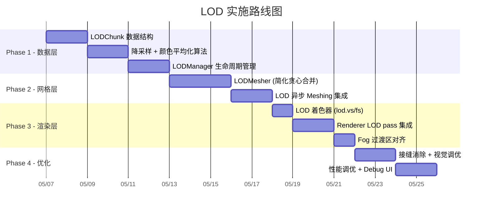

# DH-Style 动态多级 LOD 可行性评估

基于对 Mecraft 项目完整代码的深入审阅，以下是对 Distant Horizons 风格 LOD 系统的可行性分析。

---

## 一、结论概述

| 维度 | 评级 | 说明 |
|------|------|------|
| 架构兼容性 | ⭐⭐⭐⭐ | 现有 SubChunk/Chunk 分层、异步 Meshing 管线天然适配 LOD 分级 |
| 实现复杂度 | ⭐⭐⭐ | 中高复杂度，需新增 ~5-8 个文件，改动 ~4 个核心文件 |
| 性能收益预期 | ⭐⭐⭐⭐⭐ | 渲染距离从 8 chunks 扩展到 32+ chunks，GPU 面数几乎不增长 |
| 视觉质量 | ⭐⭐⭐⭐ | Fog 混合 + 颜色平均化可以很好地掩饰 LOD 过渡 |
| 开发周期 | ~2-3 周 | 核心 LOD mesh + 新 shader + 过渡控制 |

> [!IMPORTANT]
> **总体评估：高度可行。** 项目的架构设计在多个关键点上为 LOD 的引入提供了天然的接入点，不需要破坏性重构。

---

## 二、现有架构优势分析

### 2.1 SubChunk 分层架构 — 天然的 LOD 粒度单元

```
ChunkColumn (16×256×16)
 └── SubChunk[0..15] (16×16×16) ← 每个 SubChunk 独立拥有 mesh
      ├── SubChunkMesh { VAO, VBO, vertexCount }
      ├── Palette + BitPackedArray（紧凑方块存储）
      └── SubChunkType { Air | Solid | Normal }
```

- 每个 `SubChunk` 已拥有**独立 mesh 和独立 dirty 标记**（`m_dirty`, `m_meshRevision`）
- `SubChunkType::Air` 已实现空气子区块的零开销跳过
- `SubChunkType::Solid` 标记全实心子区块，这恰好为 LOD 降采样提供了快速路径

> [!TIP]
> LOD 降采样时，`SubChunkType::Air` 可直接跳过，`SubChunkType::Solid` 可直接输出单色大方块，仅 `Normal` 类型需要真正采样计算。

### 2.2 异步 Meshing 管线 — 可复用于 LOD Mesh 构建

现有管线：


关键要素：
- [ChunkMeshingService](file:///d:/project/mecraft/src/renderer/ChunkMeshingService.h) 已实现完整的**异步提交 → 后台构建 → 主线程上传**流程
- `SubChunkMeshingJob` 已包含 `revision` 用于过期检测
- `priority` 排序已基于距离，LOD 只需调整优先级权重
- `m_meshingMaxInFlight` / `m_meshingSubmitBudget` 节流机制可直接扩展

### 2.3 Frustum Culling + Region Batching — LOD 可无缝接入

[Renderer](file:///d:/project/mecraft/src/renderer/Renderer.h) 已有三级 AABB 剔除：

```
Region AABB → Column AABB → SubChunk/Aggregated AABB
```

LOD mesh 只是另一种 `SubChunkMesh`，AABB 剔除逻辑完全不需要改动。

### 2.4 Fog 系统 — 天然的 LOD 过渡遮罩

```cpp
// Renderer.cpp L354-358
float fogStart = (renderDistanceChunks + autoStartOffsetChunks) * chunkSize;
float fogEnd   = fogStart + autoFadeWidthChunks * chunkSize;
```

- 已有 Linear/Exp/Exp2 三种雾模式
- 已有 `autoDistanceByRenderDistance` 自动跟随渲染距离
- LOD 过渡区可以精确对齐到雾的起始区域，掩饰精度下降

### 2.5 TerrainGenerator 支持离线采样

```cpp
// TerrainGenerator.h
BlockID sampleBlock(int worldX, int y, int worldZ) const;
int sampleSurfaceY(int worldX, int worldZ) const;
void sampleSurfaceYBatch(int startWorldX, int worldZ, int count, int* outSurfaceY) const;
```

- LOD 区块**不需要先加载完整 Chunk**
- 可直接使用 `TerrainGenerator::sampleBlock()` 在后台线程为远处区块生成 LOD 数据
- `sampleSurfaceYBatch()` 已是批量接口，高效

---

## 三、LOD 级别设计

根据项目当前 `renderDistance = 8`（约 128 blocks），建议以下分级：

| LOD 级别 | 采样粒度 | 距离范围 (chunks) | 面数缩减比 | 说明 |
|----------|----------|-------------------|------------|------|
| LOD0 | 1×1×1 (原始) | 0 ~ renderDist | 1× | 现有渲染，不变 |
| LOD1 | 2×2×2 | renderDist ~ 2×renderDist | ~8× | 8 blocks 合并为 1 |
| LOD2 | 4×4×4 | 2×renderDist ~ 4×renderDist | ~64× | 64 blocks 合并为 1 |
| LOD3 | 8×8×8 | 4×renderDist ~ 8×renderDist | ~512× | 极远处，仅轮廓 |

### 降采样颜色平均化算法

```
对于一个 NxNxN 的 LOD 块:
  1. 统计区域内所有非空气方块的纹理颜色
  2. 按方块数量加权平均得到 RGBA
  3. 如果空气占比 > 阈值，标记为透明（跳过渲染）
  4. 最终颜色作为该 LOD 块的顶点色
```

---

## 四、关键改动点

### 4.1 新增文件 (约 5-8 个)

| 文件 | 职责 |
|------|------|
| `LODChunk.h/cpp` | LOD 数据容器，存储降采样后的方块颜色 + heightmap |
| `LODMesher.h/cpp` | LOD mesh 构建（贪心合并 + 颜色平均化） |
| `LODManager.h/cpp` | 管理 LOD 区块的生命周期、距离分级、更新调度 |
| `lod.vs / lod.fs` | LOD 专用着色器（顶点色 + 雾 + 简化光照） |
| `LODMeshingService.h/cpp` | 可选：独立的 LOD 异步 Meshing 队列 |

### 4.2 需要改动的现有文件

| 文件 | 改动内容 | 影响范围 |
|------|----------|----------|
| [Renderer.h/cpp](file:///d:/project/mecraft/src/renderer/Renderer.h) | 新增 `renderLODChunks()` pass，在 Opaque 之后渲染 | 中等 - 新增方法，不改已有逻辑 |
| [World.h/cpp](file:///d:/project/mecraft/src/world/World.h) | 新增 `LODManager` 成员，`update()` 中驱动 LOD 更新 | 小 - 新增几行调用 |
| [ResourceMgr](file:///d:/project/mecraft/src/resource/ResourceMgr.h) | 加载 LOD 着色器 | 小 |
| [GameplayScene](file:///d:/project/mecraft/src/ecs/GameplayScene.h) | 如需 ECS 集成：注册 LOD 更新 System | 可选 |

> [!NOTE]
> **关键设计原则：LOD 渲染是一个完全独立的 pass。** 它不修改现有 `SubChunkMesh` 的数据结构和渲染流程，仅在 `renderOpaqueAndCutout()` 之后追加一轮 LOD draw calls。这保证了零破坏性。

---

## 五、难点与挑战

### 5.1 LOD 过渡接缝 (Seam Artifacts) — ⚠️ 中等难度

LOD0 ↔ LOD1 边界处，由于网格粒度突变，会出现可见的接缝。

**缓解策略：**
- 在过渡区域使用 **Fog Alpha Blend** 渐变混淆
- LOD mesh 生成时，边界处保持与 LOD0 相同的高度（贴合地形轮廓）
- 深度写入策略：LOD chunks 的 far plane clip 严格对齐到 LOD0 的 fog end

### 5.2 LOD 数据的生成与存储 — ⚠️ 中等难度

每个 LOD chunk (例如 LOD2 = 4×4×4 采样) 需要扫描原始区域：
- **从已加载 Chunk**：直接读取 `SubChunk::getBlock()`
- **从未加载区域**：使用 `TerrainGenerator::sampleBlock()`

存储结构建议使用紧凑的 `std::vector<uint32_t>` (RGBA packed color + height)，而非完整 Chunk。

### 5.3 动态更新 — ⚠️ 低难度

当玩家放置/破坏方块时，只需标记对应的 LOD chunk dirty，等待下一次 LOD rebuild。由于 LOD 区块本身就是"粗糙近似"，延迟更新不会造成视觉问题。

### 5.4 内存预算 — ✅ 可控

| LOD 级别 | 区块数量 (32 chunk 可视距离) | 每区块内存 | 总计 |
|----------|----------------------------|------------|------|
| LOD0 | (2×8+1)² = 289 | ~100KB mesh | ~28 MB |
| LOD1 | ~576 (环形) | ~12KB mesh | ~7 MB |
| LOD2 | ~1024 | ~2KB mesh | ~2 MB |
| LOD3 | ~2048 | ~500B mesh | ~1 MB |
| **总计** | | | **~38 MB** |

### 5.5 GPU 面数预估

| 级别 | 每区块面数 | 区块数 | 总面数 |
|------|-----------|--------|--------|
| LOD0 | ~2000 (greedy) | 289 | ~578K |
| LOD1 | ~250 | 576 | ~144K |
| LOD2 | ~30 | 1024 | ~30K |
| LOD3 | ~5 | 2048 | ~10K |
| **总计** | | | **~762K 面** |

这远低于现代 GPU 的承受能力（轻松处理百万级三角面）。

---

## 六、LOD 着色器设计

```glsl
// lod.vs — LOD 顶点着色器（极简版本）
uniform mat4 viewProj;
uniform mat4 model;

in vec3 aPos;
in vec4 aColor;        // 降采样平均颜色 (RGBA)
in float aSunlight;    // 简化光照等级

out vec4 vColor;
out float vFogDist;

void main() {
    vec4 worldPos = model * vec4(aPos, 1.0);
    gl_Position = viewProj * worldPos;
    vColor = aColor;
    vFogDist = length(worldPos.xyz - uCameraPos);
}
```

```glsl
// lod.fs — LOD 片段着色器
in vec4 vColor;
in float vFogDist;

uniform vec3 uFogColor;
uniform float uFogStart;
uniform float uFogEnd;

out vec4 fragColor;

void main() {
    float fogFactor = smoothstep(uFogStart, uFogEnd, vFogDist);
    fragColor = mix(vColor, vec4(uFogColor, 1.0), fogFactor);
}
```

LOD 渲染不使用纹理数组（`GL_TEXTURE_2D_ARRAY`），直接用顶点色，大幅简化 GPU 开销。

---

## 七、实施路线图



---

## 八、风险矩阵

| 风险 | 概率 | 影响 | 缓解措施 |
|------|------|------|----------|
| LOD 接缝明显 | 高 | 中 | Fog 混合 + 边界高度对齐 |
| 未加载区域 LOD 与实际地形不匹配 | 低 | 低 | TerrainGenerator 是确定性的 |
| LOD 异步构建耗时过长 | 中 | 中 | 独立线程池 / 优先级低于 LOD0 meshing |
| 内存占用超预期 | 低 | 中 | LOD2/3 采用 heightmap-only 模式 |
| 与现有 Fog/Light 系统冲突 | 低 | 低 | LOD 使用独立着色器，不共享 chunk_lit |

---

## 九、建议

> [!TIP]
> **推荐从 Phase 1 + 3 开始（数据层 + 最简渲染）**，先实现 LOD1 单级，用最简 shader 把远处的地形"画出来"。视觉验证通过后再补全多级、贪心合并、过渡优化。

这种增量式方法可以在 **3-5 天内看到第一个可工作的远景渲染**，极大降低开发风险。

是否需要我制定详细的实施计划开始实现？
