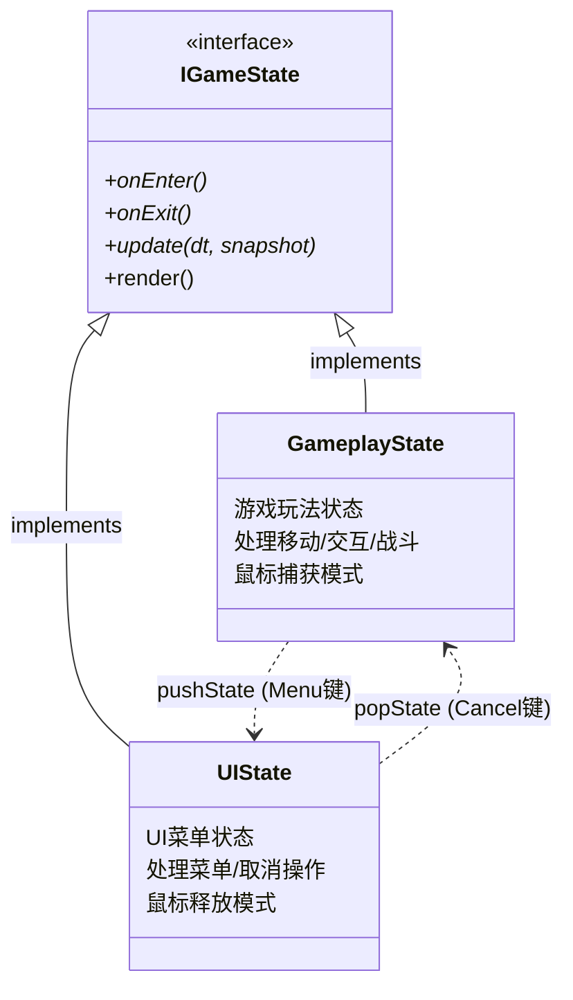
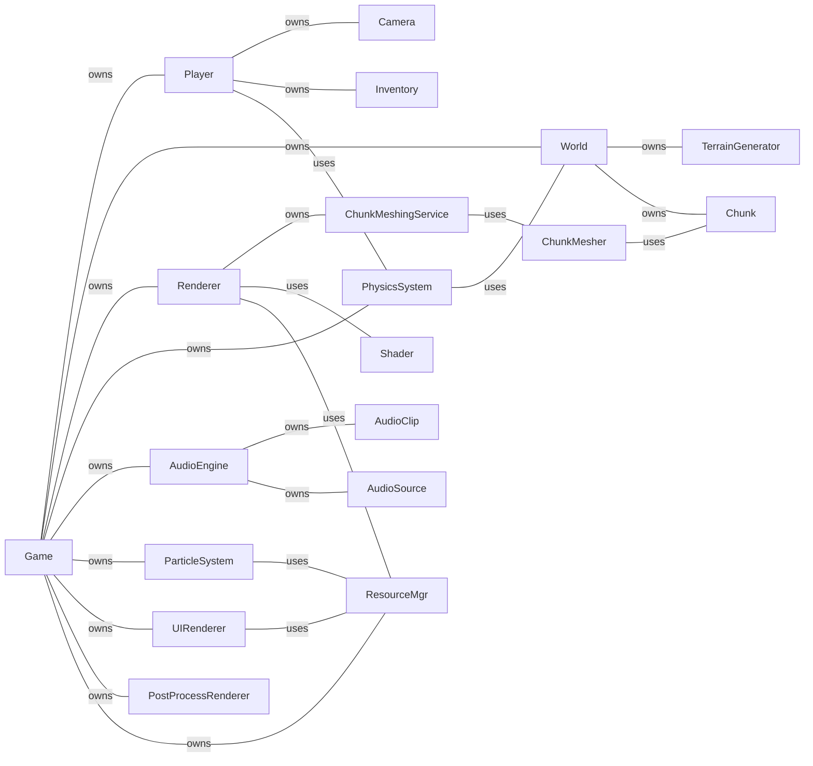
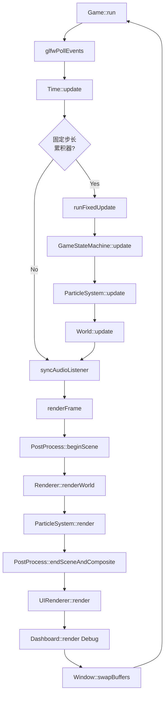
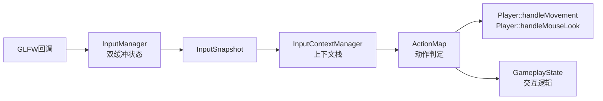
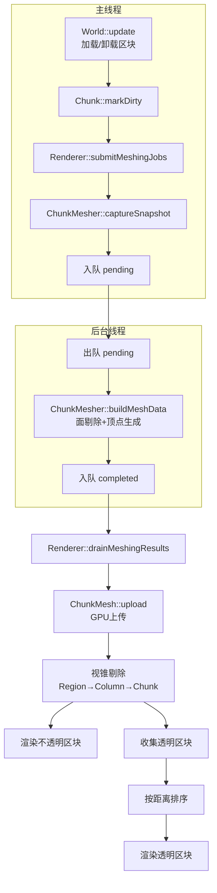
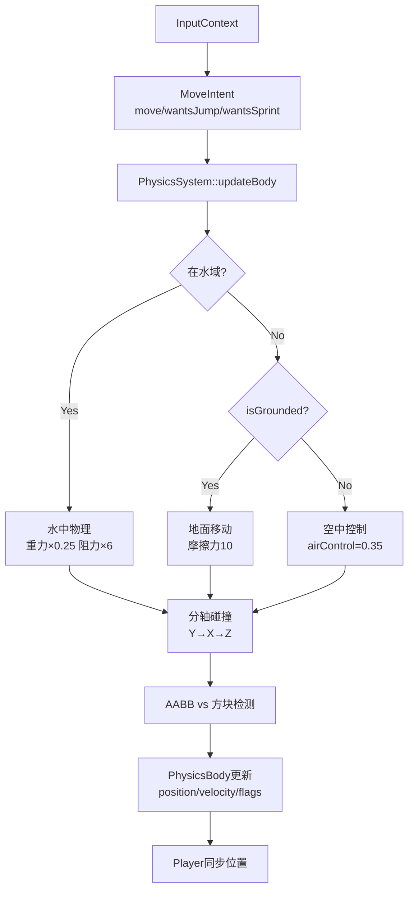

# Mecraft 项目总览

## 1. 项目简介

Mecraft 是一个基于 C++17 的 Minecraft 风格体素游戏，使用 OpenGL 3.3 Core Profile 渲染，OpenAL 音频，GLFW 窗口系统。

### 技术栈

| 类别 | 技术 |
|------|------|
| 语言 | C++17 |
| 图形 API | OpenGL 3.3 Core Profile (Glad) |
| 窗口/输入 | GLFW3 |
| 数学库 | GLM |
| 音频 | OpenAL Soft |
| 序列化 | nlohmann/json |
| 噪声生成 | FastNoiseLite (源码集成) |
| 图片加载 | stb_image (源码集成) |
| 调试 UI | ImGui (源码集成) |

---

## 2. 项目目录结构

```
mecraft/
├── main.cpp                     # 入口点
├── CMakeLists.txt               # 构建配置
├── assets/
│   ├── config/
│   │   ├── blocks.json          # 方块定义
│   │   └── keybindings.txt      # 按键绑定
│   ├── shaders/                 # GLSL 着色器 (8组 .vs/.fs)
│   ├── sounds/                  # WAV 音效 (15个)
│   └── textures/
│       ├── blocks/              # 方块贴图 (13张 16x16 PNG)
│       └── gui/                 # GUI 贴图 (widgets.png)
├── src/
│   ├── core/                    # 核心模块 (7个类)
│   ├── player/                  # 玩家模块 (3个类)
│   ├── world/                   # 世界模块 (4个类)
│   ├── renderer/                # 渲染模块 (7个类)
│   ├── resource/                # 资源管理 (1个类)
│   ├── physics/                 # 物理模块 (1个类 + 数据结构)
│   ├── particle/                # 粒子模块 (1个类)
│   ├── audio/                   # 音频模块 (4个类)
│   └── ui/                      # UI 模块 (2个类)
└── tests/                       # 测试文件
```

---

## 3. 模块概览

| 模块 | 文件数 | 核心类 | 职责 |
|------|--------|--------|------|
| **core** | 9 | Game, Window, Camera, InputManager, InputContextManager, Time, GameStateMachine | 游戏主循环、窗口管理、输入系统、状态机 |
| **core/states** | 2 | GameplayState, UIState | 游戏状态：玩法状态与UI状态 |
| **player** | 3 | Player, ActionMap, Inventory | 玩家控制、输入动作映射、物品栏 |
| **world** | 4 | World, Chunk, TerrainGenerator, BlockRegistry | 世界管理、区块存储、地形生成、方块注册 |
| **renderer** | 7 | Renderer, Shader, ChunkMesher, ChunkMeshingService, PostProcessRenderer, TestCube | 渲染管线、着色器、网格构建(多线程)、后处理 |
| **resource** | 1 | ResourceMgr | 着色器/纹理加载、纹理图集构建 |
| **physics** | 2 | PhysicsSystem | AABB碰撞、水域检测、角色物理 |
| **particle** | 1 | ParticleSystem | 方块破坏粒子效果 |
| **audio** | 4 | AudioEngine, AudioClip, AudioSource, AudioListener | 音频播放、设备热切换 |
| **ui** | 2 | UIRenderer, Dashboard | 准心/快捷栏渲染、调试面板 |

---

## 4. 类图 (Mermaid)

```mermaid
classDiagram
    direction TB

    %% ========== Core ==========
    class Game {
        -Window m_window
        -InputManager m_input
        -ActionMap m_actionMap
        -InputContextManager m_contextManager
        -GameStateMachine m_stateMachine
        -Player m_player
        -World m_world
        -PhysicsSystem m_physicsSystem
        -Renderer m_renderer
        -PostProcessRenderer m_postProcessRenderer
        -ResourceMgr m_resourceMgr
        -AudioEngine m_audioEngine
        -ParticleSystem m_particleSystem
        -UIRenderer m_uiRenderer
        -Dashboard m_dashboard
        +init(width, height, title)
        +run()
        +shutdown()
        -runFixedUpdate(dt)
        -syncAudioListener()
        -renderFrame()
    }

    class Window {
        -GLFWwindow* m_window
        -int m_width, m_height
        +init(width, height, title)
        +destroy()
        +shouldClose() bool
        +swapBuffers()
        +pollEvents()
        +getHandle() GLFWwindow*
        +getAspectRatio() float
    }

    class Camera {
        +float fov = 90.0
        +float nearPlane = 0.1
        +float farPlane = 500.0
        +float sensitivity = 0.1
        -vec3 m_position, m_front, m_up, m_right, m_worldUp
        -float m_yaw, m_pitch
        +processMouseMovement(xoffset, yoffset)
        +setPosition(pos)
        +getViewMatrix() mat4
        +getProjectionMatrix() mat4
        +getPickRay() PhysicsInfo
    }

    class InputManager {
        -GLFWwindow* m_window
        -InputSnapshot m_snapshot
        +init(window)
        +update()
        +snapshot() InputSnapshot
        +captureMouse(enabled)
    }

    class InputContextManager {
        -vector~InputContextType~ m_contextStack
        -InputManager& m_inputManager
        -ActionMap& m_actionMap
        +pushContext(type)
        +popContext()
        +isActionTriggered(action) bool
        +isActionHeld(action) bool
        +getAxisValue(axis) float
    }

    class Time {
        <<static>>
        +float currentGameTime
        +float deltaTime
        +float timeSpeed
        +init()
        +update()
    }

    class GameStateMachine {
        -vector~unique_ptr~IGameState~~ m_states
        +pushState(state)
        +popState()
        +changeState(state)
        +update(dt, snapshot)
        +render()
    }

    class IGameState {
        <<interface>>
        +onEnter()*
        +onExit()*
        +update(dt, snapshot)*
        +render()
    }

    class GameplayState {
        -GameStateMachine& m_fsm
        -Player& m_player
        -InputContextManager& m_context
        -PhysicsSystem& m_physicsSystem
        -World& m_world
        -AudioEngine& m_audioEngine
        -ParticleSystem& m_particleSystem
        -float m_placeCooldownRemaining
        -float m_footstepTimer
        +onEnter()
        +onExit()
        +update(dt, snapshot)
    }

    class UIState {
        -GameStateMachine& m_fsm
        -InputContextManager& m_context
        +onEnter()
        +onExit()
        +update(dt, snapshot)
    }

    IGameState <|-- GameplayState
    IGameState <|-- UIState
    GameStateMachine o-- IGameState

    %% ========== Player ==========
    class Player {
        -vec3 m_position, m_velocity
        -Camera m_camera
        -float m_eyeHeightBase
        -bool m_onGround, m_sprinting, m_moving
        -PhysicsBody m_body
        -MoveIntent m_intent
        -Inventory m_inventory
        +init(spawnPos)
        +update(dt, context, physicsSystem, world)
        +handleMovement(context)
        +handleMouseLook(context)
        +applyViewBob(dt)
        +wouldOverlapBlock(world) bool
    }

    class ActionMap {
        -unordered_map~Action, InputBinding~ m_bindings
        -unordered_map~Axis, AxisBinding~ m_axisBindings
        +loadFromFile(path)
        +bindKey(action, key, trigger)
        +isActionTriggered(action, snapshot) bool
        +getAxisValue(axis, snapshot) float
    }

    class Inventory {
        <<value type>>
        -BlockID m_slots[9]
        -int m_selectedSlot
        +setSelectedSlot(slot)
        +scrollSlot(delta)
        +getSelectedBlock() BlockID
    }

    Player *-- Camera
    Player *-- Inventory

    %% ========== World ==========
    class World {
        -unordered_map~int64, unique_ptr~Chunk~~ m_chunks
        -TerrainGenerator m_terrainGen
        -int m_renderDistance = 8
        -uint32_t m_seed
        -vector~ivec2~ m_loadQueue
        +init(seed, renderDist)
        +update(playerPos)
        +getBlock(x,y,z) BlockID
        +setBlock(x,y,z,id)
        +raycast(origin, dir) RayHit
        +loadChunk(cx,cz)
        +unloadChunk(cx,cz)
    }

    class Chunk {
        -BlockID m_blocks[16×256×16]
        -uint8_t m_lightMap[...]
        -ChunkMesh m_mesh
        -bool m_dirty
        -Chunk* neighbors[4]
        -int m_chunkX, m_chunkZ
        +getBlock(lx,ly,lz) BlockID
        +setBlock(lx,ly,lz,id)
        +getSunlight(lx,ly,lz) uint8_t
        +setSunlight(lx,ly,lz,val)
    }

    class TerrainGenerator {
        -uint32_t m_seed
        -int m_seaLevel = 63
        +init(seed)
        +generateChunk(chunk)
        +sampleSurfaceY(x,z) int
        +sampleBiome(x,z) TerrainBiome
        +shouldCarveCave(x,y,z) bool
        +sampleOreBlock(x,y,z,base) BlockID
    }

    class BlockRegistry {
        <<static>>
        -BlockDef s_blocks[255]
        +init(resourceMgr)
        +get(id) BlockDef
    }

    World *-- TerrainGenerator
    World o-- Chunk

    %% ========== Renderer ==========
    class Renderer {
        -Shader* m_chunkShader
        -Shader* m_outlineShader
        -ResourceMgr* m_resourceMgr
        -ChunkMeshingService m_meshingService
        -Plane[6] m_frustumPlanes
        -mat4 m_projection, m_view, m_viewProj
        +init(resourceMgr, window)
        +render(world, player, window)
        -renderWorld(world, player)
        -submitMeshingJobs(world)
        -renderOpaqueChunksAndCollectTransparent(world)
        -renderTransparentChunks(world)
        -renderBlockOutline(target)
        -updateFrustum()
        -drainMeshingResults(world)
    }

    class Shader {
        -unsigned int ID
        -unordered_map~string, int~ uniformLocationCache
        +Shader(vsPath, fsPath)
        +Shader(vsPath, fsPath, gsPath)
        +use()
        +setMat4(name, value)
        +setVec3(name, value)
        +setFloat(name, value)
        +setInt(name, value)
    }

    class ChunkMesher {
        <<static>>
        +captureSnapshot(chunk) ChunkMeshingSnapshot
        +buildMeshData(snapshot, resourceMgr) ChunkMeshData
        +generateMesh(chunk, resourceMgr)
        +shouldRenderFace(...) bool
    }

    class ChunkMeshingService {
        -thread m_worker
        -mutex m_mutex
        -condition_variable m_cv
        -queue~ChunkMeshingJob~ m_pending
        -queue~ChunkMeshingResult~ m_completed
        +start()
        +shutdown()
        +submit(job)
        +tryPopCompleted() result
    }

    class PostProcessRenderer {
        -Shader* m_shader
        -GLuint m_fbo, m_colorTex, m_rbo
        -GLuint m_vao
        -PostProcessEffects m_effects
        +init(resourceMgr, window)
        +shutdown()
        +beginScene()
        +endSceneAndComposite()
        +setEffects(effects)
    }

    class TestCube {
        <<debug>>
        -vec3 pos, scale, rotationY
        -GLuint VAO, VBO, texture
        -Shader* shader
        +draw()
        +update()
    }

    Renderer *-- ChunkMeshingService
    ChunkMeshingService ..> ChunkMesher : uses

    %% ========== Resource ==========
    class ResourceMgr {
        -unordered_map~string, unique_ptr~Shader~~ m_shaders
        -unordered_map~string, GLuint~ m_textures
        -TextureAtlas m_atlas
        +init()
        +loadShader(name, vs, fs) Shader*
        +getShader(name) Shader*
        +buildTextureAtlas(dir)
        +getTexture(name) GLuint
        +loadGuiTexture(name, path)
    }

    %% ========== Physics ==========
    class PhysicsSystem {
        -World* m_world
        +PhysicsTuning tuning
        +init(world)
        +updateBody(body, intent, world, dt)
    }

    class PhysicsBody {
        <<struct>>
        +vec3 position, velocity
        +vec3 halfExtents, colliderOffset
        +bool isGrounded, isInWater, hitWall
    }

    class RayHit {
        <<struct>>
        +bool hit
        +ivec3 blockPos, normal
        +float distance
    }

    PhysicsSystem ..> PhysicsBody : updates

    %% ========== Particle ==========
    class ParticleSystem {
        -vector~Particle~ m_particles
        -Shader* m_shader
        -TextureAtlas* m_atlas
        -GLuint m_vao, m_vbo
        +init(resourceMgr)
        +emit(blockPos, blockID)
        +update(dt)
        +render(camera)
    }

    %% ========== Audio ==========
    class AudioEngine {
        -ALCdevice* _device
        -ALCcontext* m_context
        -unordered_map~string, unique_ptr~AudioClip~~ m_clips
        -vector~unique_ptr~AudioSource~~ m_sources
        +init()
        +shutdown()
        +update()
        +playClip(name, pos, volume)
        +playSound2D(name, volume)
        +acquireSource() AudioSource*
    }

    class AudioClip {
        -ALuint m_buffer
        -string m_name, m_filepath
        -float m_duration
        +loadWAV(path) bool
        +getBufferID() ALuint
    }

    class AudioSource {
        -ALuint m_source
        -const AudioClip* m_clip
        +play()
        +stop()
        +setPosition(pos)
        +setVolume(vol)
        +isPlaying() bool
    }

    class AudioListener {
        <<static>>
        +setPosition(pos)$
        +setOrientation(front, up)$
    }

    AudioEngine o-- AudioClip
    AudioEngine o-- AudioSource

    %% ========== UI ==========
    class UIRenderer {
        -Shader* m_crosshairShader
        -Shader* m_inventoryShader
        -GLuint m_crosshairVao, m_hotbarVao
        -ResourceMgr* m_resourceMgr
        +init(resourceMgr, window)
        +render(inventory)
        +setCrosshairSize(size)
        +setCrosshairColor(color)
    }

    class Dashboard {
        <<debug>>
        +init(window)
        +render(player, world, camera, renderer, uiRenderer, time, window)
        -showPlayerStats(player)
        -showWorldStats(world)
        -showCameraStats(camera)
        -showPerformanceStats(renderer, time)
    }
```



---

## 5. 继承关系图



> 这是项目中唯一的继承体系。其余所有类均为独立类，通过组合和引用建立关系。

---

## 6. 依赖关系图

### 6.1 模块级依赖

```mermaid
graph TB
    subgraph core["core"]
        Game
        Window
        Camera
        InputManager
        InputContextManager
        Time
        GameStateMachine
        IGameState
    end

    subgraph states["core/states"]
        GameplayState
        UIState
    end

    subgraph player["player"]
        Player
        ActionMap
        Inventory
    end

    subgraph world["world"]
        World
        Chunk
        TerrainGenerator
        BlockRegistry
    end

    subgraph renderer["renderer"]
        Renderer
        Shader
        ChunkMesher
        ChunkMeshingService
        PostProcessRenderer
        TestCube
    end

    subgraph resource["resource"]
        ResourceMgr
    end

    subgraph physics["physics"]
        PhysicsSystem
    end

    subgraph particle["particle"]
        ParticleSystem
    end

    subgraph audio["audio"]
        AudioEngine
        AudioClip
        AudioSource
        AudioListener
    end

    subgraph ui["ui"]
        UIRenderer
        Dashboard
    end

    %% Game 是中心，依赖几乎所有模块
    Game --> Window
    Game --> InputManager
    Game --> Camera
    Game --> Time
    Game --> GameStateMachine
    Game --> Player
    Game --> World
    Game --> PhysicsSystem
    Game --> Renderer
    Game --> PostProcessRenderer
    Game --> ResourceMgr
    Game --> AudioEngine
    Game --> ParticleSystem
    Game --> UIRenderer
    Game --> GameplayState
    Game --> AudioListener

    %% 状态依赖
    GameplayState --> Player
    GameplayState --> World
    GameplayState --> PhysicsSystem
    GameplayState --> AudioEngine
    GameplayState --> ParticleSystem
    GameplayState --> InputContextManager
    UIState --> InputContextManager

    %% Player 依赖
    Player --> Camera
    Player --> InputContextManager
    Player --> PhysicsSystem
    Player --> Inventory
    Inventory --> BlockRegistry

    %% 输入系统
    InputContextManager --> ActionMap
    ActionMap --> InputManager

    %% 世界依赖
    World --> Chunk
    World --> TerrainGenerator
    Chunk --> BlockRegistry
    TerrainGenerator --> Chunk

    %% 渲染依赖
    Renderer --> Shader
    Renderer --> ResourceMgr
    Renderer --> ChunkMeshingService
    Renderer --> ChunkMesher
    ChunkMeshingService --> ChunkMesher
    ChunkMesher --> ResourceMgr
    ChunkMesher --> Chunk
    PostProcessRenderer --> Shader
    PostProcessRenderer --> ResourceMgr
    ParticleSystem --> ResourceMgr
    ParticleSystem --> Shader

    %% UI 依赖
    UIRenderer --> Shader
    UIRenderer --> ResourceMgr
    Dashboard --> Player
    Dashboard --> World
    Dashboard --> Camera
    Dashboard --> Renderer

    %% 物理依赖
    PhysicsSystem --> World

    %% 音频依赖
    AudioEngine --> AudioClip
    AudioEngine --> AudioSource
```



### 6.2 类级核心依赖 (简化)



---

## 7. 数据流图

### 7.1 主循环数据流



### 7.2 输入数据流



### 7.3 渲染管线数据流



### 7.4 物理数据流



---

## 8. 当前开发状态

### 8.1 已实现功能

| 系统 | 功能 | 完成度 |
|------|------|--------|
| 渲染 | 区块渲染、纹理图集、视锥剔除(三级分层)、透明物体排序渲染 | ✅ 完整 |
| 渲染 | 异步网格构建(后台线程)、后处理(水下效果) | ✅ 完整 |
| 世界 | 区块加载/卸载、地形生成(SIMD优化)、洞穴雕刻、矿石分布 | ✅ 完整 |
| 世界 | DDA射线拾取、方块破坏/放置、天光重算 | ✅ 完整 |
| 物理 | AABB碰撞、水域物理、跳跃/蹲伏、视角摆动 | ✅ 完整 |
| 输入 | 双缓冲输入、上下文栈、动作映射、按键配置文件 | ✅ 完整 |
| 音频 | 3D空间音效、2D音效、脚步声、设备热切换 | ✅ 完整 |
| 玩家 | 移动/冲刺/蹲伏、物品栏/快捷栏、射线交互 | ✅ 完整 |
| UI | 准心渲染、快捷栏渲染 | ✅ 完整 |
| 调试 | ImGui调试面板(6个子面板) | ✅ Debug模式 |
| 粒子 | 方块破坏粒子效果(Billboard渲染) | ✅ 完整 |
| 状态机 | GameplayState↔UIState 切换 | ✅ 完整 |

### 8.2 当前分支 (lightoff) 改动

- 新增 `PostProcessRenderer` — 后处理渲染器(FBO + 全屏三角形 + 水下色调效果)
- 新增后处理着色器 `postprocess.vs` / `postprocess.fs`
- 修改 `Game` — 集成后处理渲染管线
- 修改 `Window` — 可能涉及 FBO 尺寸回调
- 修改 `ResourceMgr` — 加载后处理着色器
- 修改 `Dashboard` — 可能新增后处理参数调试

### 8.3 待完善/可能的扩展方向

| 方向 | 说明 |
|------|------|
| 光照系统 | `Chunk` 已有 `m_lightMap` 字段，但完整光照传播尚未实现 |
| 生物群系 | `TerrainGenerator` 已定义4种生物群系，但视觉差异可增强 |
| 存档系统 | 世界保存/加载 |
| 多人游戏 | 网络层 |
| 更多方块 | 通过 `blocks.json` 扩展 |
| 动画系统 | 方块动画、角色动画 |
| 昼夜循环 | 已有后处理框架可扩展 |

---

## 9. 关键设计决策

1. **组合优于继承** — 除 `IGameState` 接口外，所有类通过组合/引用建立关系
2. **双缓冲输入** — `InputSnapshot` 提供帧级一致性，避免按键状态在帧中间变化
3. **输入上下文栈** — `InputContextManager` 支持状态切换时自动激活/停用不同的按键映射
4. **异步网格构建** — `ChunkMeshingService` 在后台线程构建网格，避免主线程卡顿
5. **纹理图集** — 所有方块纹理拼成一张大图，减少 draw call 和纹理切换
6. **三级视锥剔除** — Region(4×4) → Column → Chunk 逐级细化，减少剔除计算量
7. **SIMD地形生成** — SSE2/AVX2 加速噪声计算，提升区块生成速度
8. **物理分轴碰撞** — Y→X→Z 三步独立检测，简化碰撞响应逻辑
9. **生产者-消费者模式** — 网格构建服务使用 mutex + condition_variable 实现线程安全
