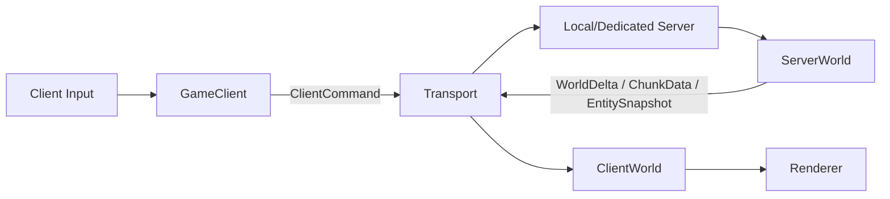
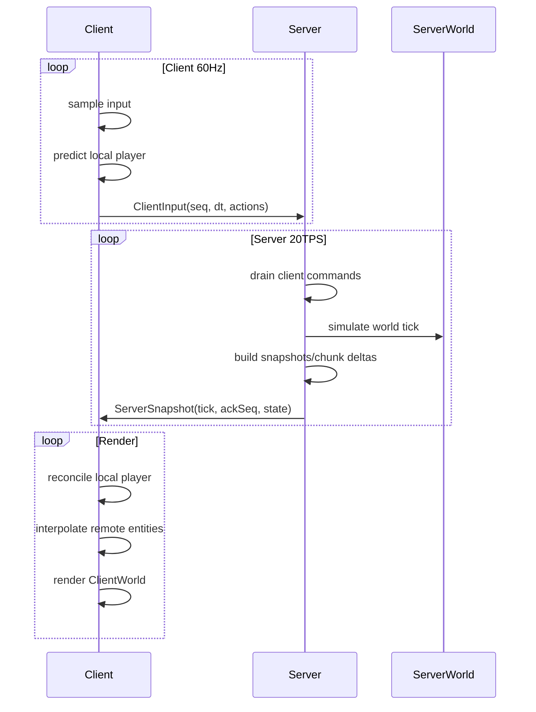

# Mecraft 联机与本地服务器架构设计方案

> 目标：把当前单机直连 `World + ECS + Renderer` 的玩法结构，演进为 Minecraft 式的“客户端 + 本地服务器”架构。单机模式先运行 in-process local server，后续再替换为真实网络传输，避免区块加载、实体同步、交互逻辑在未来联机改造时被大面积重写。

---

## 1. 核心结论

建议优先级：

1. 先做最小 C/S 分离骨架。
2. 再在 C/S 架构上做区块加载与流送优化。
3. 最后替换传输层，支持真正局域网/公网联机。

不建议现在先深度优化现有 `World::update(playerPos)` 加载逻辑，因为当前结构默认“本地客户端直接拥有世界真相”。联机后，区块生成、模拟、保存、权限校验都应该属于服务端；客户端只保存可见/可预测的世界副本，并负责渲染、输入采样、预测和插值。

目标形态：



单机模式不是“旧单机特殊路径”，而是：

```text
Game process
  GameClient
  LocalServer
  InProcessTransport
```

联机模式只替换为：

```text
Game process A: GameClient + NetworkTransport
Game process B: DedicatedServer + NetworkTransport
```

---

## 2. 当前架构问题

当前核心路径大致是：

```text
GameFrameOrchestrator
  input.update()
  GameplayScene::runFixedUpdate()
  GameplayScene::runOneTick()
  GameSession::updateWorldAroundLocalPlayer()
    World::update(localPlayerPosition)
      load/unload chunks
      update light/fluid/weather
  renderFrame(session.world(), local ECS snapshot)
```

特点：

- `World` 同时承担真实世界存储、区块生成、加载窗口、光照、流体、天气等职责。
- ECS 系统直接读写同一个 `World`。
- 玩家输入直接改变本地权威状态。
- Renderer 直接从 `World::getActiveChunks()` 取区块。
- 区块加载中心来自本地玩家坐标，不存在“服务端判断客户端兴趣范围”的层。

这些对单机很快，但对联机不合适。联机需要明确回答：

- 谁能决定方块是否被放置/破坏？
- 谁能决定实体位置、掉落物、伤害、饥饿、流体流动？
- 客户端看到的区块是服务端真相，还是本地生成结果？
- 客户端移动是否允许预测？
- 客户端丢包/延迟时如何保持画面平滑？

结论：需要把 `World` 拆成服务端权威世界和客户端渲染/预测世界。

---

## 3. 设计目标

### 3.1 功能目标

- 单机模式使用本地服务器，不再走旧单机特殊逻辑。
- 服务端权威管理世界、实体、区块生成、保存、交互校验。
- 客户端负责输入采样、镜头、渲染、音频、UI、预测与插值。
- 支持多人玩家进入同一个世界。
- 支持区块按玩家兴趣范围流送。
- 支持后续替换传输层：in-process、loopback socket、LAN、公网。

### 3.2 性能目标

- 区块生成、光照、mesh 构建、GPU 上传继续分阶段限流。
- 服务端 tick 与客户端 render 解耦。
- 客户端不等待服务端每帧确认才渲染。
- 区块流送具备 load/simulation/render/unload 多层半径。

### 3.3 安全与一致性目标

- 服务端是权威状态源。
- 客户端提交“意图”，不是直接提交“结果”。
- 服务端校验移动、交互距离、物品栏、方块可放置性。
- 客户端预测失败时可回滚或平滑纠正。

---

## 4. 总体模块划分

建议新增模块：

```text
src/
  net/
    Protocol.h
    Transport.h
    InProcessTransport.h
    PacketCodec.h
    NetTypes.h

  server/
    GameServer.h
    ServerSession.h
    ServerWorld.h
    ServerPlayer.h
    ChunkTicketManager.h
    ChunkStreamService.h
    ServerSimulation.h
    WorldSaveService.h

  client/
    GameClient.h
    ClientWorld.h
    ClientEntityStore.h
    ClientPrediction.h
    SnapshotInterpolator.h
    ChunkReceiveService.h
```

当前模块演进方向：

| 当前模块 | 未来归属 | 说明 |
|---|---|---|
| `World` | 先保留，逐步拆为 `ServerWorld` / `ClientWorld` | 避免一次性大重构 |
| `TerrainGenerator` | Server | 客户端不自行生成正式区块 |
| `LightService` | Server + Client 可选 | 服务端产出基础光照；客户端可做视觉缓存 |
| `FluidSystem` | Server | 流体结果广播给客户端 |
| `DropSystem` | Server authoritative | 客户端只渲染掉落物 |
| `PhysicsSystem` | Server + Client prediction | 玩家移动客户端预测，服务端校验 |
| `TerrainStreamingService` | Client | 只负责客户端已有区块的 meshing/upload |
| `GameplayScene` | 拆分 Server ECS / Client ECS | 输入、渲染、动画留客户端；权威模拟放服务端 |
| `GameSession` | 变为 ClientSession + LocalServerHost | 单机模式同时拥有 client/server |

---

## 5. 服务端权威模型

### 5.1 服务端拥有的状态

服务端保存并推进：

- 世界种子、时间、天气。
- 所有已加载区块的方块、流体、光照、heightmap。
- 区块生成队列、保存队列、ticket 状态。
- 玩家实体权威位置、速度、生命、饥饿、物品栏。
- 掉落物、怪物、交互实体。
- 方块随机刻、流体 tick、支撑规则、作物等后续玩法逻辑。

### 5.2 客户端拥有的状态

客户端保存：

- `ClientWorld`：服务端发来的区块副本和增量更新。
- 本地玩家预测状态。
- 远端实体插值状态。
- 渲染 mesh/cache/GPU 资源。
- UI、音频、粒子、第一人称手部、动画状态。

客户端可以临时预测：

- 本地玩家移动。
- 本地玩家破坏进度视觉。
- 方块放置/破坏的 optimistic visual，可被服务端结果覆盖。

客户端不能最终决定：

- 方块实际改变。
- 物品栏数量。
- 伤害、拾取、掉落。
- 实体最终位置。

---

## 6. Tick 与帧率模型

推荐时钟：

| 层 | 频率 | 职责 |
|---|---:|---|
| Client render | 可变帧率 | 渲染、UI、音频、插值 |
| Client fixed update | 60 Hz | 输入采样、本地预测、相机 |
| Server tick | 20 TPS | 世界权威模拟、区块 ticket、实体逻辑 |
| Server network flush | 20-60 Hz | 快照/增量发送，可按优先级拆包 |

服务端 tick 应该独立于客户端渲染帧：



---

## 7. 传输层设计

先定义传输接口，避免业务代码依赖 socket：

```cpp
class ITransportEndpoint {
public:
    virtual void send(Packet packet) = 0;
    virtual bool tryReceive(Packet& out) = 0;
};
```

第一阶段实现：

- `InProcessTransport`：两个线程安全队列，client/server 同进程通信。
- 可选 `LoopbackTransport`：本机 socket，用于早期真实编码/拆包测试。

后续实现：

- `TcpTransport`：简单可靠，适合早期。
- `UdpTransport`：配合可靠通道/序号/重传，适合动作游戏。
- `SteamNetworkingTransport` 或 ENet：可作为成熟方案。

### 7.1 通道划分

即使先用 in-process，也按通道建模：

| 通道 | 可靠性 | 内容 |
|---|---|---|
| ReliableControl | reliable ordered | 登录、握手、断开、配置、维度切换 |
| ReliableWorld | reliable ordered | 区块数据、方块变更、物品栏、重要事件 |
| UnreliableState | unreliable sequenced | 高频实体快照、玩家输入 |
| ReliableChat | reliable ordered | 聊天、命令、系统消息 |

早期可以全部 reliable，但协议层先保留 channel 字段。

---

## 8. 协议消息设计

### 8.1 基础类型

```cpp
using ClientId = uint32_t;
using EntityNetId = uint32_t;
using TickId = uint32_t;

struct ChunkPos {
    int32_t x;
    int32_t z;
};

struct BlockPos {
    int32_t x;
    int16_t y;
    int32_t z;
};
```

### 8.2 Client -> Server

| 消息 | 用途 |
|---|---|
| `ClientHello` | 协议版本、用户名、资源包/方块表版本 |
| `ClientReady` | 客户端资源加载完成 |
| `ClientInput` | 移动、视角、跳跃、潜行、疾跑等输入 |
| `ClientViewConfig` | render distance、simulation preference、客户端能力 |
| `ClientBlockAction` | 开始破坏、继续破坏、取消、放置 |
| `ClientInventoryAction` | 物品栏点击、快捷栏切换、丢弃 |
| `ClientCommand` | 聊天命令 |
| `ClientKeepAlivePong` | 延迟检测 |

客户端提交的是意图：

```cpp
struct ClientBlockAction {
    uint32_t sequence;
    BlockActionKind kind;
    BlockPos target;
    BlockPos placePos;
    uint16_t selectedSlot;
    glm::vec3 eyePos;
    glm::vec3 viewDir;
};
```

服务端需要校验：

- 玩家是否真的够得到。
- 目标区块是否已加载。
- 所选物品是否存在且数量足够。
- 方块是否允许放置/破坏。
- 当前游戏模式是否允许操作。

### 8.3 Server -> Client

| 消息 | 用途 |
|---|---|
| `ServerHello` | 协议接受、服务端配置 |
| `JoinAccepted` | 分配 `ClientId`、初始实体、出生点 |
| `ChunkData` | 完整区块或 section 数据 |
| `ChunkUnload` | 客户端应释放该区块 |
| `BlockUpdateBatch` | 方块/流体/光照增量 |
| `EntitySpawn` | 新实体出现 |
| `EntityDespawn` | 实体移除 |
| `EntitySnapshot` | 高频实体位置/状态 |
| `PlayerCorrection` | 本地玩家预测纠正 |
| `InventorySnapshot` | 物品栏权威结果 |
| `GameEvent` | 声音、粒子、伤害、拾取等事件 |
| `ServerKeepAlivePing` | 延迟检测 |

---

## 9. 区块加载与流送设计

### 9.1 区块状态

服务端区块状态：

```text
Missing
QueuedForLoad
Generating
LoadedNoTick
Ticking
PendingSave
PendingUnload
```

客户端区块状态：

```text
Missing
Receiving
LoadedData
MeshingQueued
Meshed
Visible
PendingVisualUnload
```

### 9.2 Ticket 系统

新增 `ChunkTicketManager`，服务端不再让 `World::update(playerPos)` 直接决定全部加载。

Ticket 类型：

| Ticket | 来源 | 作用 |
|---|---|---|
| `PlayerSimulation` | 玩家位置 | 中心区块 ticking |
| `PlayerView` | 客户端视距 | 外层区块 loaded/no-tick 并发送 |
| `Spawn` | 世界出生点 | 常驻加载，可选 |
| `Forced` | 命令/调试 | 强制加载 |
| `PortalOrTeleport` | 后续传送 | 预加载目标区域 |

推荐半径：

```text
simulationDistance = 8
serverViewDistance = min(clientRenderDistance + 1, serverMaxViewDistance)
serverLoadDistance = serverViewDistance + 1
serverUnloadDistance = serverLoadDistance + 2
clientVisualUnloadDelay = 0.5s - 2.0s
```

这比当前同一个 `renderDistance` 同时控制加载和卸载更稳：

```text
Ticking radius       : 实体/流体/随机刻
LoadedNoTick radius  : 可发送、可查询、可补边界
Client render radius : 客户端 mesh/render
Unload radius        : 滞后卸载，避免边界抖动
```

### 9.3 流送优先级

区块发送优先级：

1. 玩家脚下和移动方向前方。
2. 当前视锥内。
3. 距离近的优先。
4. 已完成生成的优先。
5. 边界 no-tick 区块低优先。

服务端每 tick 有发送预算：

```text
maxChunkBytesPerClientPerTick
maxChunkColumnsPerClientPerTick
maxBlockUpdatesPerClientPerTick
```

客户端每帧有 mesh/upload 预算：

```text
maxMeshJobsSubmittedPerFrame
maxMeshUploadBytesPerFrame
maxMeshUploadTimeMs
```

---

## 10. 区块数据格式

早期可先直接发送完整 chunk：

```cpp
struct ChunkDataMessage {
    ChunkPos pos;
    uint32_t chunkRevision;
    std::vector<SectionData> sections;
    HeightMapData heightMap;
    BiomeData biomes;
};
```

建议从一开始按 section 设计：

```cpp
struct SectionData {
    uint8_t sectionY;
    Palette<StateID> blockPalette;
    BitPackedArray blockStates;
    Palette<StateID> fluidPalette;
    BitPackedArray fluidStates;
    LightArray blockLight;
    LightArray skyLight;
};
```

原因：

- 空 section 可省略。
- 修改区块时可按 section 增量发送。
- 后续压缩更容易。

压缩路线：

1. 阶段一：无压缩，便于调试。
2. 阶段二：RLE 空 section + palette bit-packing。
3. 阶段三：Zstd/LZ4 压缩 chunk payload。

---

## 11. 实体同步

### 11.1 EntityNetId

服务端为所有需要同步的实体分配 `EntityNetId`：

- 玩家。
- 掉落物。
- 生物。
- 投射物。
- 后续方块实体。

客户端维护映射：

```text
EntityNetId -> entt::entity
```

### 11.2 快照格式

```cpp
struct EntitySnapshotItem {
    EntityNetId id;
    EntityKind kind;
    glm::vec3 position;
    glm::vec3 velocity;
    float yaw;
    float pitch;
    uint32_t flags;
};
```

远端实体使用插值：

```text
renderTime = latestServerTime - interpolationDelay
```

本地玩家使用预测 + reconciliation：

1. 客户端每个输入包带 `sequence`。
2. 客户端本地立即模拟移动。
3. 服务端返回 `ackSequence + authoritativeState`。
4. 客户端丢弃已确认输入，从权威状态重放未确认输入。
5. 偏差小则平滑修正，偏差大则瞬时纠正。

---

## 12. 玩家移动与预测

第一阶段可以不做完整 rollback，只做简单预测：

- 客户端本地跑 `CharacterPhysicsSystem`。
- 服务端也跑同一套物理。
- 服务端定期发送玩家权威位置。
- 客户端检测偏差并平滑拉回。

第二阶段增加输入重放：

```cpp
struct PendingInput {
    uint32_t sequence;
    float dt;
    MoveIntent move;
    LookIntent look;
    ActionBits actions;
};
```

服务端校验：

- 移动速度上限。
- 飞行/创造模式权限。
- 碰撞穿墙。
- dt 合法范围。
- 输入序号递增。

---

## 13. 方块交互同步

### 13.1 破坏方块

客户端：

- 本地显示破坏进度。
- 发送 `StartBreak / ContinueBreak / CancelBreak`。

服务端：

- 校验距离、工具、游戏模式、目标方块。
- 计算实际破坏进度。
- 完成后修改 `ServerWorld`。
- 发送 `BlockUpdateBatch`、掉落物 `EntitySpawn`、声音/粒子 `GameEvent`。

### 13.2 放置方块

客户端：

- 可显示短暂 optimistic preview。
- 发送 `PlaceBlock`。

服务端：

- 校验物品栏和目标位置。
- 调用放置规则。
- 修改世界、扣除物品。
- 广播 `BlockUpdateBatch` 和 `InventorySnapshot`。

客户端收到服务端结果后，以服务端为准覆盖本地显示。

---

## 14. 物品栏与掉落物

物品栏必须服务端权威。

客户端可以本地拖拽 UI，但最终结果由服务端确认：

```text
ClientInventoryAction(sequence, operation)
Server validates
Server sends InventorySnapshot or InventoryDelta
Client applies authoritative inventory
```

掉落物：

- 服务端生成、合并、拾取、生命周期。
- 客户端只接收实体快照和事件。
- 拾取判定服务端完成，客户端播放结果。

---

## 15. 世界保存

服务端负责保存：

```text
saves/
  world_id/
    level.json
    players/
      <uuid>.json
    regions/
      r.x.z.mcr2
```

建议早期先做 chunk-column 文件或 region 文件：

- `ServerWorld` 标记 dirty chunks。
- `WorldSaveService` 后台写盘。
- 卸载前确保 dirty chunk 已排队保存。
- 单机退出时 flush。

客户端不保存世界真相，只保存：

- 设置。
- 资源缓存。
- 服务器列表。
- 可选临时 chunk cache，但不作为权威。

---

## 16. 渲染侧改造

当前 `RenderGameplayFrameRequest` 使用 `session.world()`。目标是改成读取 `ClientWorld`：

```text
Renderer / TerrainStreamingService
  read ClientWorld::getActiveChunks()
```

为了平滑迁移，可以先定义接口：

```cpp
class IWorldView {
public:
    virtual const ChunkMap& getActiveChunks() const = 0;
    virtual uint64_t getActiveChunkRevision() const = 0;
    virtual BlockID getBlock(int x, int y, int z) const = 0;
    virtual StateID getFluidState(int x, int y, int z) const = 0;
};
```

然后：

- `World` 临时实现 `IWorldView`。
- `ClientWorld` 实现 `IWorldView`。
- Renderer 逐步依赖 `IWorldView`，不再依赖权威 `World`。

---

## 17. ECS 拆分方案

不要一次性拆所有 ECS。推荐先按职责拆：

### 17.1 客户端 ECS

保留：

- 输入采样。
- 本地预测。
- 相机。
- View bob。
- 手部动画。
- Steve/生物渲染动画。
- 粒子、音频触发。
- UI 状态。

### 17.2 服务端 ECS / Simulation

迁移：

- 玩家物理权威模拟。
- 方块交互结果。
- 掉落物物理、合并、拾取。
- 生物 AI。
- 饥饿、伤害。
- 流体和方块 tick。

早期可以不新建完整 server ECS，而是先建立 `ServerSimulation`，逐步把现有系统搬过去。

---

## 18. 分阶段实施计划

### Phase 0：接口隔离，不改变行为

目标：为拆分创造插槽。

- 新增 `IWorldView`。
- Renderer/TerrainStreamingService 改依赖 `IWorldView` 或只依赖只读 world 接口。
- 把 `World::update(playerPos)` 的“加载中心”封装成 `ChunkInterest` 输入。
- 明确 `World` 的读接口和写接口。

完成标准：

- 游戏行为不变。
- 渲染层不再必须知道这是权威 `World`。

### Phase 1：LocalServer + InProcessTransport 骨架

目标：单机也走 C/S 消息流，但世界仍可复用现有 `World`。

- 新增 `GameServer`。
- 新增 `GameClient`。
- 新增 `InProcessTransport`。
- 客户端发送 `ClientInput` / `ClientViewConfig`。
- 服务端返回最小 `ServerSnapshot`。
- `GameSession` 拆出 `LocalServerHost`。

完成标准：

- 单机启动时创建 client + local server。
- 本地玩家输入能通过消息到达 server。
- server tick 独立运行。

### Phase 2：ClientWorld 镜像

目标：客户端不再直接渲染服务端 `World`。

- 新增 `ClientWorld`。
- 服务端发送 spawn 区域 `ChunkData`。
- 客户端接收后构建 chunk 副本。
- Renderer 改渲染 `ClientWorld`。
- 服务端发送 `BlockUpdateBatch`，客户端应用到 `ClientWorld`。

完成标准：

- 客户端画面来自 `ClientWorld`。
- 服务端 `World` 修改需要通过消息反映到客户端。

### Phase 3：区块 ticket 与流送

目标：替换当前同半径加载/卸载方案。

- 新增 `ChunkTicketManager`。
- 新增 `ChunkStreamService`。
- 支持 simulation/view/load/unload 半径。
- 支持 per-client chunk send budget。
- 支持 `ChunkUnload`。

完成标准：

- 玩家移动时，服务端按 ticket 加载区块。
- 客户端按消息接收/卸载区块。
- 边缘有 unload hysteresis，不再同半径抖动。

### Phase 4：实体同步

目标：多实体通过快照同步。

- 新增 `EntityNetId`。
- 支持 `EntitySpawn` / `EntityDespawn` / `EntitySnapshot`。
- 本地玩家使用 prediction/correction。
- 远端实体使用 interpolation。

完成标准：

- 本地玩家由服务端确认。
- 远端玩家/掉落物由快照驱动显示。

### Phase 5：交互权威化

目标：方块、物品栏、掉落物不再由客户端最终决定。

- `BlockBreakSystem` / `BlockPlaceSystem` 客户端只发意图。
- 服务端执行交互规则。
- 服务端广播方块变化和物品栏变化。
- 掉落物生成、拾取、合并迁移服务端。

完成标准：

- 客户端不能直接改权威世界。
- 本地预测失败可被服务端纠正。

### Phase 6：真实网络传输

目标：从 in-process 替换为 socket。

- 增加 packet codec。
- 增加连接握手、版本校验。
- 增加断线处理、超时、keepalive。
- 支持客户端连接 dedicated server。

完成标准：

- 两个进程可以进入同一个世界。
- 单机仍使用 local server。

---

## 19. 推荐目录与类职责

### 19.1 `server/GameServer`

职责：

- 管理 server lifecycle。
- 持有 `ServerWorld`、连接列表、tick loop。
- drain client messages。
- 调用 `ServerSimulation`。
- flush outgoing messages。

### 19.2 `server/ServerWorld`

职责：

- 包装或继承当前 `World` 的权威能力。
- 提供 chunk load/generate/save。
- 提供 block mutation API。
- 提供 world query API。

### 19.3 `server/ChunkTicketManager`

职责：

- 接收每个玩家的位置和 view config。
- 计算目标 chunk state。
- 输出 load/generate/tick/unload 决策。

### 19.4 `server/ChunkStreamService`

职责：

- 跟踪每个客户端已发送区块。
- 根据 ticket 和预算发送 `ChunkData`。
- 发送 `ChunkUnload`。
- 合并 `BlockUpdateBatch`。

### 19.5 `client/GameClient`

职责：

- 采样输入并发命令。
- 接收 server 消息。
- 驱动 `ClientWorld`、prediction、interpolation。
- 向 UI/Renderer 暴露状态。

### 19.6 `client/ClientWorld`

职责：

- 保存客户端区块副本。
- 应用 `ChunkData` / `BlockUpdateBatch`。
- 提供 `IWorldView` 给 renderer、raycast、视觉系统。
- 标记 dirty subchunk 触发 remesh。

---

## 20. 调试工具

建议新增 debug dashboard 项：

- 当前模式：SingleplayerLocalServer / RemoteClient / DedicatedServer。
- RTT、packet loss、pending reliable packets。
- client input sequence / server ack sequence。
- client predicted position vs server authoritative position。
- 每客户端 chunk tickets 数量。
- chunk send queue 深度。
- server loaded/ticking/no-tick chunk 数量。
- `ClientWorld` loaded/meshed/visible chunk 数量。
- 每 tick 发送字节数。
- block update batch 数量。

建议新增命令：

```text
/net stats
/net fake_lag <ms>
/net fake_loss <percent>
/chunk tickets
/chunk stream
/server tps
```

---

## 21. 测试计划

### 21.1 单元测试

- Packet encode/decode roundtrip。
- `ChunkPos` / `EntityNetId` 序列化。
- `ChunkTicketManager` 半径计算。
- `ChunkStreamService` 不重复发送区块。
- `ClientWorld` 应用 `ChunkData` 和 `BlockUpdateBatch`。

### 21.2 集成测试

- Local client/server 握手。
- 玩家出生并收到初始区块。
- 玩家移动触发区块发送和卸载。
- 放置/破坏方块经 server 确认。
- 掉落物 spawn/despawn 同步。

### 21.3 回归测试

- 单机模式行为保持可玩。
- 切换 render distance 不崩溃。
- 快速移动不会无限积压 chunk queue。
- 断开连接释放资源。

---

## 22. 关键风险

| 风险 | 影响 | 缓解 |
|---|---|---|
| 一次性拆分过大 | 容易长期不可运行 | 按 phase 保持每阶段可运行 |
| Renderer 深度依赖 `World` | 阻碍 `ClientWorld` | 先做 `IWorldView` |
| 客户端/服务端共用 ECS 困难 | 系统职责混乱 | 先拆交互边界，再迁移系统 |
| 方块 ID/状态 ID 不一致 | 网络数据无法解释 | 握手校验 registry version |
| 区块数据太大 | 首次加载慢 | section 化、palette、压缩 |
| 预测纠正抖动 | 手感差 | 先平滑纠正，再引入输入重放 |
| 服务端 tick 被生成阻塞 | 多人卡顿 | 保持异步生成与预算 |

---

## 23. 最小可落地里程碑

第一个可验收版本不需要真联机，目标是“单机已经是 C/S”：

```text
启动游戏
  创建 LocalServer
  创建 GameClient
  通过 InProcessTransport 握手
  ServerWorld 生成出生区块
  Server 发送 ChunkData
  ClientWorld 接收区块
  Renderer 渲染 ClientWorld
  Client 发送输入
  Server 返回本地玩家位置快照
```

完成这个里程碑后，再继续做区块 ticket 优化，收益最大，也最不容易返工。

---

## 24. 近期任务建议

推荐下一批实际代码任务：

1. 新增 `IWorldView`，让渲染侧准备接入 `ClientWorld`。
2. 新增 `net/Protocol.h` 和 `InProcessTransport`。
3. 新增 `GameServer` / `GameClient` 空骨架，跑通握手。
4. 新增 `ClientWorld`，先复用 `Chunk` 数据结构。
5. 实现 `ChunkData` 的内存消息，不急着做二进制编码。
6. 改单机启动流程为 `LocalServer + GameClient`。
7. 再实现 `ChunkTicketManager` 和多半径加载策略。

---

## 25. 设计原则

- 服务端拥有真相，客户端拥有体验。
- 网络协议传输意图和快照，不传 C++ 对象指针。
- 单机和联机走同一条 gameplay 逻辑。
- 先 in-process，后 socket；先可读消息结构，后二进制压缩。
- 先保证每个 phase 可运行，再追求完整优化。
- 区块加载、模拟、渲染、卸载必须分层，不再共享一个半径。
