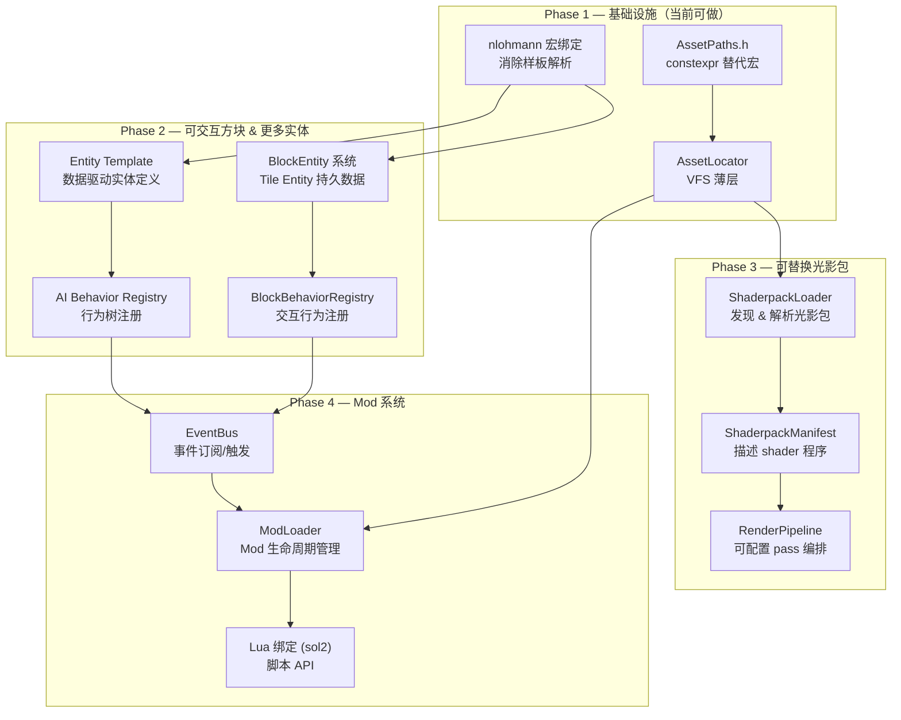

# 架构可扩展性分析：能否支撑未来功能

## 前置回答

**上一轮提出的方案（constexpr 路径 + nlohmann 绑定 + 轻量 AssetLocator）是一个好的基础层，但不足以独立支撑你列出的全部远期目标。** 它解决的是"数据怎么找到、怎么解析"的问题，而你列出的四个方向各自还需要额外的架构支撑。

下面逐一分析。

---

## 一、可交互方块（工作台、熔炉、箱子等）

### 当前架构的能力

| 已有组件 | 支持程度 |
|---------|---------|
| [BlockDef](file:///d:/project/mecraft/src/world/block/Block.h#L218-L252) | ❌ 没有交互行为字段 |
| [BlockStateRegistry](file:///d:/project/mecraft/src/world/block/BlockStateRegistry.h) | ✅ 属性状态机已就位（朝向、开/关等） |
| [PlacementStrategyRegistry](file:///d:/project/mecraft/src/world/block/Placement.h) | ✅ 字符串→函数指针的注册模式，可复用 |
| [MeshBuilderRegistry](file:///d:/project/mecraft/src/renderer/mesh/MeshBuilderRegistry.h) | ✅ 同样的注册模式 |

### 缺什么

**1. Block Entity / Tile Entity 概念**

工作台、熔炉、箱子需要**持久化数据**（物品栏、冶炼进度、自定义名称等），这不是 BlockDef 的 flat struct 能表达的。需要：

```
世界中的方块 = BlockID + BlockState + (可选) BlockEntity
```

```cpp
// engine/block/BlockEntity.h
class BlockEntity {
public:
    virtual ~BlockEntity() = default;
    virtual void tick(World& world, glm::ivec3 pos) {}
    virtual void onInteract(PlayerEntity& player) {}
    virtual void serialize(nlohmann::json& out) const {}
    virtual void deserialize(const nlohmann::json& in) {}
};

// 箱子示例
class ChestBlockEntity : public BlockEntity {
    Inventory m_inventory{27};  // 27 格
    void onInteract(PlayerEntity& player) override {
        // 打开箱子 UI
    }
};
```

**2. Block Behavior Registry（交互行为注册表）**

复用你已有的 `PlacementStrategyRegistry` 模式：

```cpp
// 字符串 → 行为函数的注册
using BlockInteractFn = bool(*)(World&, BlockID, glm::ivec3, PlayerEntity&);
using BlockEntityFactoryFn = std::unique_ptr<BlockEntity>(*)();

class BlockBehaviorRegistry {
public:
    static void registerInteraction(const std::string& name, BlockInteractFn fn);
    static void registerEntityFactory(const std::string& name, BlockEntityFactoryFn fn);
    // ...
};
```

然后在 `blocks.json` 中声明：
```json
{
    "id": "minecraft:crafting_table",
    "interaction": "crafting_table",
    "blockEntity": null
},
{
    "id": "minecraft:furnace",
    "interaction": "furnace",
    "blockEntity": "furnace"
}
```

### 结论

> [!IMPORTANT]
> 上一轮的方案**可以支撑这个方向**。BlockDef 加几个字符串字段（`interaction`、`blockEntity`），用 nlohmann 宏绑定自动解析，再加一个 `BlockBehaviorRegistry` 即可。这个 Registry 模式你已经用了 3 次（Placement、MeshBuilder、IdRegistry），非常成熟。

---

## 二、更多实体类型

### 当前架构的能力

| 已有组件 | 支持程度 |
|---------|---------|
| [entt::registry](file:///d:/project/mecraft/src/ecs/GameplayRegistry.h) | ✅ 天然支持任意组件组合 |
| [ISystem](file:///d:/project/mecraft/src/ecs/ISystem.h) + [GameplayScene](file:///d:/project/mecraft/src/ecs/GameplayScene.h) | ✅ 系统管线已支持有序执行 |
| [ECS Components](file:///d:/project/mecraft/src/ecs/components/) | 🟡 12 个组件文件，但偏向 Player/Mob 特化 |

### 当前的问题

你的 ECS 组件拆分已经不错（Transform、Physics、Audio 等独立文件），但 **Mob 系统**的扩展方式存在隐患。看你的 systems 目录：

```
MobAISystem / MobAnimationSystem / MobCollisionSystem /
MobCombatSystem / MobLootSystem / MobRenderSystem /
MobSoundSystem / MobSpawnSystem
```

如果每种新实体（村民、矿车、船、掉落沙、TNT、箭矢...）都需要一套专用 System，这个目录会爆炸。

### 需要的改进

**1. 数据驱动的实体定义（Entity Archetype / Entity Template）**

```json
// config/entities.json
{
    "entities": [
        {
            "id": "minecraft:zombie",
            "components": {
                "health": { "max": 20 },
                "physics": { "width": 0.6, "height": 1.95, "gravity": true },
                "ai": { "type": "hostile_melee", "speed": 0.23, "attackDamage": 3 },
                "loot": { "table": "zombie" },
                "model": "humanoid",
                "sounds": { "ambient": "zombie_ambient", "hurt": "zombie_hurt" }
            }
        },
        {
            "id": "minecraft:pig",
            "components": {
                "health": { "max": 10 },
                "physics": { "width": 0.9, "height": 0.9, "gravity": true },
                "ai": { "type": "passive_wander", "speed": 0.25 },
                "loot": { "table": "pig" },
                "model": "quadruped"
            }
        }
    ]
}
```

**2. AI Behavior 注册（复用 Registry 模式）**

```cpp
using AIBehaviorFactoryFn = std::unique_ptr<AIBehavior>(*)(const nlohmann::json& params);

class AIBehaviorRegistry {
public:
    static void registerBehavior(const std::string& name, AIBehaviorFactoryFn fn);
    static std::unique_ptr<AIBehavior> create(const std::string& name,
                                               const nlohmann::json& params);
};
```

### 结论

> [!NOTE]
> **ECS 架构本身完全能支撑。** entt 就是为这个场景设计的。关键改进是把实体的"配方"（哪些组件、什么参数）从 C++ 硬编码搬到 JSON 配置。这正好是 nlohmann 绑定方案要做的事。

---

## 三、可替换光影包

### 当前架构的能力

| 已有组件 | 支持程度 |
|---------|---------|
| [RenderPass](file:///d:/project/mecraft/src/renderer/passes/RenderPass.h) 抽象基类 | ✅ 每个 pass 独立 init/shutdown |
| 17 个 RenderPass 实现 | 🟡 写死在 C++ 中 |
| [ShaderpackDirectives](file:///d:/project/mecraft/src/renderer/shaderpack/ShaderpackDirectives.h) | ✅ 参数已经开始解耦 |
| [ResourceMgr::loadShader()](file:///d:/project/mecraft/src/resource/ResourceMgr.h#L53-L55) | 🟡 路径硬编码 |

### 需要的架构

可替换光影包（类似 OptiFine/Iris）是一个**大型特性**，需要：

**1. Shaderpack Loader — 这是 AssetLocator 方案的核心受益者**

```
shaderpacks/
├── DerivativeMain/          ← 内置包
│   ├── shaders.properties   ← 解析为 ShaderpackDirectives
│   ├── shaders/
│   │   ├── gbuffers_terrain.vsh / .fsh
│   │   ├── composite.vsh / .fsh
│   │   ├── deferred.vsh / .fsh
│   │   └── ...
│   └── textures/
│       └── noise2D.png
└── BSL_Shaders/             ← 用户光影包
    ├── shaders.properties
    └── shaders/...
```

```cpp
class ShaderpackLoader {
public:
    /// Discover available shaderpacks from the shaderpacks directory.
    std::vector<std::string> listAvailable() const;

    /// Load a shaderpack by name, parsing shaders.properties and
    /// resolving all shader source paths.
    ShaderpackManifest load(const std::string& packName) const;

private:
    AssetLocator* m_locator;  // ← AssetLocator 的价值在这里体现
};
```

**2. ShaderpackManifest — 描述一个光影包的全部内容**

```cpp
struct ShaderpackManifest {
    std::string name;
    ShaderpackDirectives directives;  // 你已有的结构

    // 每个渲染阶段的 shader 源路径
    struct ProgramSource {
        std::string vertexPath;
        std::string fragmentPath;
        std::string geometryPath;   // optional
        std::vector<std::string> defines;
    };

    std::unordered_map<std::string, ProgramSource> programs;
    // "gbuffers_terrain", "composite", "deferred", "final" etc.
};
```

**3. 渲染管线的 Pass 编排需要可配置化**

当前 17 个 RenderPass 在 `Renderer::init()` 中硬编码顺序。要支持不同光影包启用/禁用不同 pass，需要：

```cpp
class RenderPipeline {
    std::vector<RenderPass*> m_activePasses;

public:
    /// Rebuild the pass chain based on the loaded shaderpack manifest.
    void configure(const ShaderpackManifest& manifest);
    void execute(const RenderContext& ctx);
};
```

### 结论

> [!WARNING]
> 这是四个方向中**最复杂的**。constexpr 路径和 AssetLocator 是必要的基础设施（光影包本质上是一个资源目录），但远远不够。还需要 ShaderpackLoader、ShaderpackManifest、可配置 RenderPipeline。
>
> 好消息是你现有的 `RenderPass` 抽象和 `ShaderpackDirectives` 已经走在正确的方向上，不需要推倒重来。

---

## 四、Mod 支持（Lua 脚本 / Forge-like API）

### 这是对架构要求最高的功能

先明确两种 Mod 方案的本质区别：

| 方案 | 复杂度 | 安全性 | 性能 | 示例 |
|------|--------|--------|------|------|
| **Lua 脚本** | 中 | ✅ 沙箱隔离 | 🟡 FFI 开销 | ComputerCraft, Minetest |
| **C++ 原生 API（DLL 插件）** | 高 | ❌ 无隔离 | ✅ 零开销 | Forge (Java), Bukkit |

### 无论哪种方案，都需要的底层架构

**1. Event Bus（事件总线）— 目前完全没有**

这是 Mod API 的**灵魂**。Forge/Fabric 的核心就是一个事件系统。

```cpp
// engine/event/EventBus.h
class EventBus {
public:
    template<typename EventType>
    using Handler = std::function<void(EventType&)>;

    template<typename EventType>
    void subscribe(Handler<EventType> handler, int priority = 0);

    template<typename EventType>
    void fire(EventType& event);
};

// 事件类型示例
struct BlockInteractEvent {
    BlockID blockId;
    glm::ivec3 position;
    entt::entity player;
    bool cancelled = false;  // Mod 可取消
};

struct BlockBreakEvent { ... };
struct EntitySpawnEvent { ... };
struct ItemUseEvent { ... };
```

**2. Mod Lifecycle Manager**

```cpp
class ModLoader {
public:
    void discoverMods(const std::filesystem::path& modsDir);
    void loadAll();        // 加载所有 mod
    void initAll();        // 触发 onInit 回调
    void shutdownAll();    // 卸载

private:
    std::vector<std::unique_ptr<ModInstance>> m_mods;
};
```

**3. 如果走 Lua 路线**

推荐 [sol2](https://github.com/ThePhD/sol2)（header-only, C++17, 与你的技术栈完美匹配）：

```cpp
// Lua mod 的 API 暴露
void bindModAPI(sol::state& lua) {
    // 注册方块
    lua["mecraft"]["registerBlock"] = [](const std::string& id, sol::table def) {
        BlockDef blockDef;
        blockDef.isSolid = def.get_or("isSolid", true);
        blockDef.isTransparent = def.get_or("isTransparent", false);
        // ...
        BlockRegistry::registerBlock(NamespacedId(id), blockDef);
    };

    // 监听事件
    lua["mecraft"]["onBlockInteract"] = [](sol::function handler) {
        EventBus::subscribe<BlockInteractEvent>([handler](BlockInteractEvent& e) {
            handler(e.blockId, e.position);
        });
    };
}
```

Mod 脚本示例（Lua）：
```lua
-- mods/my_mod/init.lua
local mecraft = require("mecraft")

-- 注册新方块
mecraft.registerBlock("mymod:magic_stone", {
    isSolid = true,
    isTransparent = false,
    lightLevel = 8,
    textures = { all = "magic_stone" }
})

-- 右键工作台时触发
mecraft.onBlockInteract(function(blockId, pos)
    if blockId == mecraft.getBlockId("minecraft:crafting_table") then
        print("Opened crafting table at " .. tostring(pos))
    end
end)
```

### 现有架构需要改什么

| 现有系统 | 需要的改动 | 原因 |
|---------|-----------|------|
| [BlockRegistry](file:///d:/project/mecraft/src/world/block/Block.h#L262-L291) | ✅ 已有 `registerBlock()` API | 注释已标记 "Mod API" |
| [ItemRegistry](file:///d:/project/mecraft/src/item/Item.h#L66-L100) | ✅ 已有 `registerItem()` API | 同上 |
| [IdRegistry](file:///d:/project/mecraft/src/engine/registry/IdRegistry.h) | ✅ 动态分配 RuntimeId | 天然支持运行时注册 |
| [BuiltinIds](file:///d:/project/mecraft/src/game/content/BuiltinIds.h) | 🟡 需要区分 builtin vs mod | X-Macro 只能用于编译期已知的 ID |
| [GameplayScene](file:///d:/project/mecraft/src/ecs/GameplayScene.h) | 🔴 需要支持动态注册 System | 当前 `addFixedUpdateSystem<T>()` 是编译期模板 |
| [GameplayServices](file:///d:/project/mecraft/src/ecs/GameplayServices.h) | 🟡 需要暴露给 Mod 安全子集 | 不能让 Mod 直接 `require()` World 指针 |
| EventBus | 🔴 **不存在，需要新建** | Mod 系统的核心 |
| AssetLocator | 🔴 **不存在，需要新建** | Mod 需要注入自己的资源 |

### 结论

> [!IMPORTANT]
> 你现有的 Registry 模式（IdRegistry、BlockRegistry、ItemRegistry 都已有 `register*()` 方法）说明**你已经为 Mod 支持留了口**。缺的两块关键基础设施是：**EventBus** 和 **AssetLocator**。
>
> 上一轮提出的 AssetLocator 正好是 Mod 资源加载的必需品；而 EventBus 是全新的系统，需要从零搭建。

---

## 五、总结：分阶段演进路线图



### 每个阶段的依赖关系

| 阶段 | 前置依赖 | 核心新增 | 你已有的可复用基础 |
|------|---------|---------|-----------------|
| **P1** 基础设施 | 无 | AssetPaths.h, nlohmann 绑定, AssetLocator | Paths.h (替换), Block.cpp 解析逻辑 (简化) |
| **P2** 交互方块+实体 | P1 的 nlohmann 绑定 | BlockEntity, Entity Template, Behavior Registry | PlacementStrategyRegistry 模式, entt ECS |
| **P3** 光影包 | P1 的 AssetLocator | ShaderpackLoader, Manifest, Pipeline 配置 | RenderPass 抽象, ShaderpackDirectives |
| **P4** Mod 系统 | P1 + P2 的 Registry 模式 | EventBus, ModLoader, Lua 绑定 | `registerBlock()`/`registerItem()` 已存在 |

---

## 六、直接回答你的问题

> **这套方案可以支撑吗？**

| 功能方向 | 上一轮方案能否支撑 | 还需要什么 |
|---------|------------------|-----------|
| 可交互方块 | ✅ 基本够用 | + BlockEntity + BlockBehaviorRegistry |
| 更多实体 | ✅ 基本够用 | + Entity Template JSON + AI Behavior Registry |
| 可替换光影包 | 🟡 只是基础之一 | + ShaderpackLoader + 可配置 Pipeline |
| Mod 系统 (Lua) | 🟡 只是基础之一 | + EventBus + ModLoader + sol2 绑定 |

**关键认知**：上一轮的方案（constexpr + nlohmann 绑定 + AssetLocator）不是一个"功能方案"，而是一个**基础设施层**。它解决的是"数据从哪来、怎么解析"，这在四个方向上都会被用到。但每个方向还需要自己的领域架构。

> [!TIP]
> **好消息是你当前的架构走在正确的方向上**：
> - Registry 模式（字符串→函数指针）你已用了 3 次，直接复用
> - `registerBlock()` / `registerItem()` 已经标记 "Mod API"
> - entt ECS 天然支持动态组件组合
> - RenderPass 抽象和 ShaderpackDirectives 已经开始解耦渲染参数
>
> 不需要推倒重来，只需要在现有基础上**逐层叠加**。
