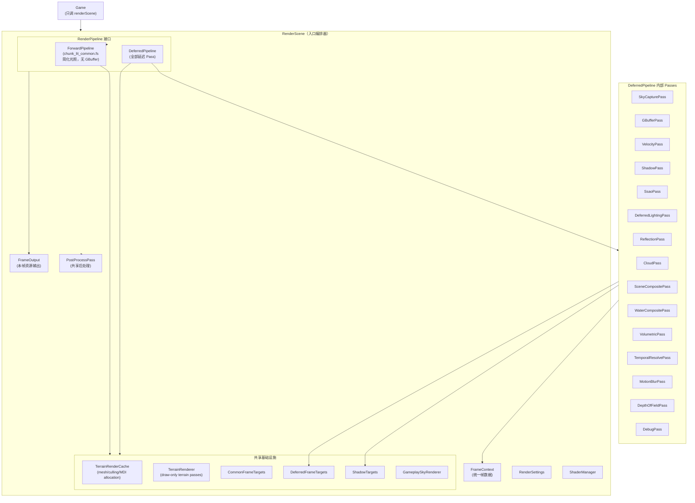

# 渲染管线清理与现代化重构 + Game 类渲染剥离

> **v3 更新** — 根据代码审查修订阶段顺序：接口先行、资源分层、后处理共享、TerrainRenderer 分步提取

## 已确认的设计决策

| # | 决策 | 结论 |
|---|------|------|
| Q1 | PostProcessRenderer 归属 | 吸收为 **RenderScene 共享 PostProcessPass**，Forward/Deferred 都复用 |
| Q2 | TerrainRenderer 粒度 | 分两步拆：先提取 terrain cache/meshing 生命周期，再提取 draw-only TerrainRenderer |
| Q3 | Dashboard 配置路径 | 本轮一并调整，Dashboard 改写 `RenderSettings` |
| Q4 | RainRenderer 归属 | 留到后续 Game 类全面清理（当前是临时测试类） |
| Q5 | 前向/延迟管线 | 拆分为独立 Pipeline 实现，可运行时切换，类似 MC 光影包开关 |
| Q6 | 阶段顺序 | `RenderScene` / `RenderPipeline` / `FrameContext` 先落地，后续 Pass 拆分面向新接口 |

---

## 背景

### 核心病灶

| 类 | 行数 | 核心问题 |
|---|------|---------|
| [Renderer.cpp](file:///d:/project/mecraft/src/renderer/Renderer.cpp) | **4830 行** (226KB) | 上帝类：20+ 渲染 pass 编排、uniform 绑定、FBO 管理、mesh 管理、chunk 剔除、前向+延迟硬耦合 |
| [Renderer.h](file:///d:/project/mecraft/src/renderer/Renderer.h) | **833 行** (39KB) | 30+ Shader* 指针、189 行 `RenderPipelineSettings`、10+ `bind*Uniforms` 方法 |
| [Game.cpp](file:///d:/project/mecraft/src/core/Game.cpp) | **678 行** | `renderFrame()` 322 行：后处理参数搬运、阴影数据中转、太阳投影计算 |
| [DeferredRenderTargets.cpp](file:///d:/project/mecraft/src/renderer/DeferredRenderTargets.cpp) | **56KB** | 50+ FBO/纹理句柄、30+ bind/copy 方法 |

### 前向/延迟耦合现状

当前 [Renderer::renderOpaqueAndCutout()](file:///d:/project/mecraft/src/renderer/Renderer.cpp#L268-L281) 中前向和延迟管线通过 `if (mode == HybridDeferred)` 硬分支切换：

```cpp
// Renderer.cpp:268-281 — 前向/延迟硬耦合
void Renderer::renderOpaqueAndCutout(...) {
    beginFrame(camera, window);
    m_currentFrameData = buildRenderFrameData(world);
    if (m_pipelineSettings.mode == HybridDeferred &&
        renderWorldDeferred(world, camera, window, frame)) {
        return;  // deferred 成功，跳过 forward
    }
    // forward fallback
    m_gameplaySkyRenderer.render(...);
    m_chunkShader = m_chunkForwardShader;
    renderWorldForward(world, frame);
}
```

问题：
- 前向路径和延迟路径共享同一个 `Renderer` 类的状态（`m_deferredFrameActive` 标志位到处传播）
- 透明渲染 [renderTransparentAndOverlays()](file:///d:/project/mecraft/src/renderer/Renderer.cpp#L283-L305) 中大量 `if (m_deferredFrameActive)` 分支
- 前向路径被迫初始化 `DeferredRenderTargets`（尽管不使用大部分延迟资源）
- 无法干净地独立测试/切换两条管线

### 违反的设计原则

1. **单一职责 (SRP)** — `Renderer` 混合了两条管线 + 20+ pass + 资源管理 + chunk 系统
2. **依赖倒置 (DIP)** — `Game` 直接依赖 `Renderer` 具体实现做数据搬运
3. **开闭原则 (OCP)** — 增加新管线特性必须修改 `Renderer` 巨类
4. **高耦合** — 前向/延迟通过 `m_deferredFrameActive` 标志位隐式耦合

---

## 设计目标

1. **管线解耦**：前向管线和延迟管线是独立的 `RenderPipeline` 实现，可运行时热切换（像 MC 光影包开关）
2. **接口先行**：先建立 `RenderScene`、`RenderPipeline`、`FrameContext`、`FrameOutput` 的最小稳定边界，后续拆分不再围绕 `Renderer` 私有状态设计
3. **Pass-Oriented**：延迟管线内部每个 pass 是独立类
4. **共享基础设施**：`TerrainRenderer`、`FrameContext`、共享后处理、分层 render targets 被两条管线复用
5. **Game 解耦**：Game 只调用 `renderScene()`，不关心当前用哪条管线
6. **渐进式重构**：每阶段独立可编译可运行

### 设计边界修订

1. **禁止把 `Renderer` 私有状态包装成新类 API**：新 Pass 只依赖 `FrameContext`、`FrameOutput`、`SharedRenderResources` 和明确的 target handle。
2. **PostProcess 是共享能力**：Forward 和 Deferred 都需要 bloom、tonemap、screen roll、underwater、exposure 等后处理。Deferred 可以启用完整效果，Forward 可以使用同一个 `PostProcessPass` 的简化配置。
3. **Render targets 分层管理**：避免 `DeferredRenderTargets` 继续承载所有资源。
   - `CommonFrameTargets`：scene color/depth、post-process input/output、bloom/exposure 等两条管线都可能使用的资源。
   - `DeferredFrameTargets`：GBuffer、SSAO、SSR、velocity、history、volumetric、cloud 等延迟专属资源。
   - `ShadowTargets`：CSM shadow map、transparent shadow color/depth，可由 Deferred 使用，未来 Forward 阴影也可复用。
4. **Terrain 分步拆分**：先把 chunk mesh 生命周期、meshing job、MDI allocation、render column cache 提成 `TerrainRenderCache` / `TerrainMeshingCoordinator`；再把 draw opaque/cutout/water/transparent/shadow 提成 `TerrainRenderer`。
5. **管线切换必须有状态重置契约**：切换 Forward/Deferred、窗口 resize、shadow resolution 变更都必须 invalidate temporal/history 资源，并通过 `FrameOutput` 暴露本帧可用的 depth、weather mask、shadow data 等资源。

---

## 架构设计

### 整体架构图



### 核心类设计

#### 1. `RenderPipeline` — 管线接口

```cpp
// src/renderer/RenderPipeline.h
class RenderPipeline {
public:
    virtual ~RenderPipeline() = default;
    
    // Lifecycle
    virtual void init(SharedRenderResources& shared) = 0;
    virtual void shutdown() = 0;
    
    // Per-frame
    virtual FrameOutput renderFrame(const FrameContext& ctx) = 0;
    
    // Name for UI/debug
    virtual const char* name() const = 0;
    
    // Query capabilities (for Game/UI to adapt)
    virtual bool supportsDeferred() const = 0;
    virtual bool supportsDebugView() const = 0;
};
```

#### 2. `ForwardPipeline` — 前向管线

```cpp
// src/renderer/ForwardPipeline.h
class ForwardPipeline : public RenderPipeline {
public:
    void init(SharedRenderResources& shared) override;
    void shutdown() override;
    void renderFrame(const FrameContext& ctx) override;
    
    const char* name() const override { return "Forward (Vanilla)"; }
    bool supportsDeferred() const override { return false; }
    bool supportsDebugView() const override { return false; }
    
private:
    Shader* m_chunkForwardShader = nullptr;
    // 前向路径只需要: terrain draw + sky + forward fog + post-process
    // 不需要 DeferredFrameTargets 中的 GBuffer/SSAO/SSR/VFog FBO
};
```

前向管线包含：
- `chunk_lit_common.fs` 的简化光照（已有 `hammonDiffuseApprox`）
- 天空渲染（`GameplaySkyRenderer` 共享）
- 基础 forward fog
- 简化后处理（bloom + tonemap，不需要 Bloomy Fog / TAA / 体积雾）
- 透明几何体直接 alpha blend

#### 3. `DeferredPipeline` — 延迟管线

```cpp
// src/renderer/DeferredPipeline.h
class DeferredPipeline : public RenderPipeline {
public:
    void init(SharedRenderResources& shared) override;
    void shutdown() override;
    void renderFrame(const FrameContext& ctx) override;
    
    const char* name() const override { return "Deferred (Shader Effects)"; }
    bool supportsDeferred() const override { return true; }
    bool supportsDebugView() const override { return true; }
    
private:
    // 所有延迟 Pass（owned）
    std::unique_ptr<SkyCapturePass> m_skyCapturePass;
    std::unique_ptr<GBufferPass> m_gbufferPass;
    std::unique_ptr<VelocityPass> m_velocityPass;
    std::unique_ptr<ShadowPass> m_shadowPass;
    std::unique_ptr<SsaoPass> m_ssaoPass;
    std::unique_ptr<DeferredLightingPass> m_lightingPass;
    std::unique_ptr<ReflectionPass> m_reflectionPass;
    std::unique_ptr<CloudPass> m_cloudPass;
    std::unique_ptr<SceneCompositePass> m_sceneCompositePass;
    std::unique_ptr<WaterCompositePass> m_waterCompositePass;
    std::unique_ptr<VolumetricPass> m_volumetricPass;
    std::unique_ptr<TemporalResolvePass> m_taaPass;
    std::unique_ptr<MotionBlurPass> m_motionBlurPass;
    std::unique_ptr<DepthOfFieldPass> m_dofPass;
    std::unique_ptr<DebugPass> m_debugPass;
};
```

`PostProcessPass` 不属于 `DeferredPipeline` 独占资源。`DeferredPipeline` 输出 HDR scene/depth/weather mask 等 `FrameOutput` 后，由 `RenderScene` 调用共享 `PostProcessPass`；`ForwardPipeline` 也输出同样契约的 scene target，并复用同一个后处理实现。

#### 4. `SharedRenderResources` — 两条管线共享的基础设施

```cpp
// src/renderer/SharedRenderResources.h
struct SharedRenderResources {
    TerrainRenderCache* terrainCache; // chunk culling + mesh + MDI allocation
    TerrainRenderer* terrain;      // terrain draw commands
    CommonFrameTargets* commonTargets;
    DeferredFrameTargets* deferredTargets; // nullptr when active pipeline is pure forward
    ShadowTargets* shadowTargets;
    ShaderManager* shaders;        // shader 生命周期
    GameplaySkyRenderer* sky;      // 天空渲染
    ResourceMgr* resources;        // 纹理 atlas 等
    
    // Sub-renderer injection（临时，直到 ECS-driven）
    HumanoidRenderer* humanoidRenderer;
    DropRenderer* dropRenderer;
    ParticleSystem* particleSystem;
    DropSystem* dropSystem;
};
```

#### 5. `FrameOutput` — 管线输出契约

`FrameOutput` 替代当前 `m_deferredFrameActive` 这类隐式状态。Game、UI、后处理、手持物品渲染不再询问“是不是 deferred”，而是询问本帧是否提供对应资源。

```cpp
// src/renderer/FrameOutput.h
struct FrameOutput {
    GLuint sceneColorTex = 0;
    GLuint sceneDepthTex = 0;
    GLuint weatherMaskTex = 0;
    GLuint gbufferDepthTex = 0;

    bool hasDeferredInputs = false;
    bool hasDebugView = false;
    bool skipPostProcess = false;

    FirstPersonShadowData heldItemShadow{};
};
```

#### 6. `RenderScene` — 入口编排器

```cpp
// src/renderer/RenderScene.h
class RenderScene {
public:
    void init(ResourceMgr& resourceMgr);
    void shutdown();
    
    // 唯一入口
    void renderFrame(const World& world, const Camera& camera, const Window& window,
                     const BlockTargetRenderData& target, const BlockBreakRenderData& blockBreak);
    
    // 管线切换（运行时）
    void setPipelineMode(PipelineMode mode);  // Forward / Deferred
    PipelineMode getPipelineMode() const;
    const char* activePipelineName() const;
    
    // 配置
    void setSettings(const RenderSettings& settings);
    RenderSettings getSettings() const;
    
    // Sub-renderer injection
    void setHumanoidRenderer(HumanoidRenderer* hr);
    void setDropRenderer(DropRenderer* dr);
    // ...
    
private:
    FrameContext buildFrameContext(const World& world, const Camera& camera);
    
    // 共享基础设施
    SharedRenderResources m_shared;
    std::unique_ptr<TerrainRenderCache> m_terrainCache;
    std::unique_ptr<TerrainRenderer> m_terrainRenderer;
    std::unique_ptr<CommonFrameTargets> m_commonTargets;
    std::unique_ptr<DeferredFrameTargets> m_deferredTargets;
    std::unique_ptr<ShadowTargets> m_shadowTargets;
    ShaderManager m_shaders;
    GameplaySkyRenderer m_skyRenderer;
    PostProcessPass m_postProcessPass;
    
    // 管线实现
    std::unique_ptr<ForwardPipeline> m_forwardPipeline;
    std::unique_ptr<DeferredPipeline> m_deferredPipeline;
    RenderPipeline* m_activePipeline = nullptr;  // points to one of the above
    
    RenderSettings m_settings;
};
```

#### 7. `FrameContext` — 统一帧数据

```cpp
// src/renderer/FrameContext.h
struct CameraData {
    glm::mat4 view, projection, viewProj;
    glm::mat4 jitteredViewProj, jitteredInvViewProj;
    glm::mat4 invViewProj;
    glm::vec3 position;
    float nearPlane, farPlane;
};

struct FrameContext {
    CameraData camera;
    CameraData prevCamera;
    
    uint64_t frameIndex;
    float deltaTime;
    glm::vec2 jitter, prevJitter;
    
    // Sky / Atmosphere  
    GameplaySkyRenderer::SkyColors skyColors;
    GameplaySkyRenderer::SkyIlluminanceData skyIlluminance;
    float skyIntensity;
    
    // Weather
    float weatherWetness, weatherStorm;
    float surfaceWetness, skyWetness, fogWetness, cloudWetness;
    float precipitation, lightningFlash;
    
    // Timing
    float animationTime, shaderTime;
    
    // State
    bool eyeInWater;
    bool moonShadowActive;
    bool hasPreviousFrame;
    
    // Settings (read-only refs)
    const RenderSettings* settings;
    
    // Shared resources
    SharedRenderResources* shared;
};
```

#### 8. 配置分层

```cpp
// src/renderer/RenderSettings.h
struct ShadowSettings { /* shadow-only 字段 */ };
struct SsaoSettings { /* ssao-only 字段 */ };
struct VolumetricSettings { /* volumetric-only 字段 */ };
struct CloudSettings { /* cloud-only 字段 */ };
struct ReflectionSettings { /* reflection-only 字段 */ };
struct TaaSettings { /* taa-only 字段 */ };
struct PostProcessSettings { /* 含 bloom/tonemap/grade/exposure */ };
struct DebugSettings { /* debug modes */ };
struct FogSettings { /* forward fog */ };
struct WeatherRenderSettings { /* weather visual params */ };

enum class PipelineMode { Forward, Deferred };

struct RenderSettings {
    PipelineMode pipelineMode = PipelineMode::Deferred;
    ShadowSettings shadow;
    SsaoSettings ssao;
    VolumetricSettings volumetric;
    CloudSettings cloud;
    ReflectionSettings reflection;
    TaaSettings taa;
    PostProcessSettings postProcess;
    DebugSettings debug;
    FogSettings fog;
    WeatherRenderSettings weather;
};

// 过渡期双向转换
RenderSettings fromLegacy(const Renderer::RenderPipelineSettings& legacy);
Renderer::RenderPipelineSettings toLegacy(const RenderSettings& settings);
```

---

## User Review Required

> [!IMPORTANT]
> **视觉效果保证**：整个重构不修改任何 shader 文件（`.fs`, `.vs`, `.glsl`），不修改任何渲染算法逻辑，不改变 pass 执行顺序。重构前后渲染结果应当像素级一致。

> [!WARNING]
> **编译约束**：根据 CLAUDE.md，编译需由用户在 IDE 中进行。每个 Phase 结束时编译一次验证。

> [!IMPORTANT]
> **管线切换语义**：运行时切换管线类似 MC 光影包开关。切换时会重新初始化/销毁对应管线的 GPU 资源（FBO/纹理）。前向管线不分配延迟管线的 GBuffer/SSAO/SSR 等资源（节省显存）。切换不需要重启，但切换瞬间可能有一帧闪烁（历史帧数据重置）。

---

## Proposed Changes

### Phase 1: 最小架构骨架 — FrameContext + RenderSettings + RenderScene + RenderPipeline

**目标**：先建立稳定边界，不改变任何现有行为。后续 Pass 拆分直接面向新接口，避免围绕 `Renderer` 私有状态做二次迁移。

---

#### [NEW] [FrameContext.h](file:///d:/project/mecraft/src/renderer/FrameContext.h)

统一帧数据结构体。初期作为 `Renderer::RenderFrameData` 的 thin wrapper + 额外字段。

#### [NEW] [FrameOutput.h](file:///d:/project/mecraft/src/renderer/FrameOutput.h)

统一管线输出契约，承接 scene color/depth、gbuf depth、weather mask、shadow data、debug/postprocess skip 标志等，逐步替代 `m_deferredFrameActive` 和 Game 对 `Renderer` 具体状态的查询。

#### [NEW] [RenderSettings.h](file:///d:/project/mecraft/src/renderer/RenderSettings.h)

分层配置结构体。包含 `PipelineMode` 枚举。提供与旧 `RenderPipelineSettings` 的双向转换函数 `fromLegacy()`/`toLegacy()`。

#### [NEW] [RenderPipeline.h](file:///d:/project/mecraft/src/renderer/RenderPipeline.h)

最小管线抽象接口。初期只提供 `renderFrame(const FrameContext&) -> FrameOutput`、`init()`、`shutdown()`、`name()` 和 capability 查询。

#### [NEW] [RenderScene.h](file:///d:/project/mecraft/src/renderer/RenderScene.h)
#### [NEW] [RenderScene.cpp](file:///d:/project/mecraft/src/renderer/RenderScene.cpp)

入口编排器骨架。初期内部仍委托 legacy `Renderer`，只建立 `buildFrameContext()`、`setSettings()`、`lastFrameOutput()`、`setPipelineMode()` 等接口。

#### [MODIFY] [Renderer.h](file:///d:/project/mecraft/src/renderer/Renderer.h)

新增 legacy facade 对接方法，保证外部调用可以逐步迁移到 `RenderScene`，不一次性删除旧 API。

#### [MODIFY] [CMakeLists.txt](file:///d:/project/mecraft/CMakeLists.txt)

添加本阶段新增 `.cpp` 文件。后续每个新增 `.cpp` 的 Phase 都必须同步更新 CMake 源文件清单。

---

### Phase 2: Render target 分层 — CommonFrameTargets + DeferredFrameTargets + ShadowTargets

**目标**：把“前向也要用的资源”和“延迟专属资源”从 `DeferredRenderTargets` 中分离出来，为前向管线节省显存提供真实边界。

---

#### [NEW] [CommonFrameTargets.h](file:///d:/project/mecraft/src/renderer/CommonFrameTargets.h)
#### [NEW] [CommonFrameTargets.cpp](file:///d:/project/mecraft/src/renderer/CommonFrameTargets.cpp)

管理 scene color/depth、post-process capture、bloom/exposure 需要的共享 target。

#### [NEW] [DeferredFrameTargets.h](file:///d:/project/mecraft/src/renderer/DeferredFrameTargets.h)
#### [NEW] [DeferredFrameTargets.cpp](file:///d:/project/mecraft/src/renderer/DeferredFrameTargets.cpp)

承接 GBuffer、SSAO、SSR、velocity、history、volumetric、cloud 等延迟专属 target。初期可包装现有 `DeferredRenderTargets`，但对外接口按子系统分组。

#### [NEW] [ShadowTargets.h](file:///d:/project/mecraft/src/renderer/ShadowTargets.h)
#### [NEW] [ShadowTargets.cpp](file:///d:/project/mecraft/src/renderer/ShadowTargets.cpp)

管理 CSM shadow map、transparent shadow color/depth。先由 Deferred 使用，保留 Forward 未来启用阴影的空间。

#### [MODIFY] [DeferredRenderTargets.h](file:///d:/project/mecraft/src/renderer/DeferredRenderTargets.h)

过渡期保留现有接口，同时添加按子系统分组的 target accessor 结构体（`GBufferTargets`, `SsaoTargets` 等）。禁止新增前向共用资源到 `DeferredRenderTargets`。

#### [MODIFY] [CMakeLists.txt](file:///d:/project/mecraft/CMakeLists.txt)

添加本阶段新增 `.cpp` 文件。

---

### Phase 3: RenderPass 基类 + SSAO 试点拆分

**目标**：定义 `RenderPass` 接口，用 SSAO 验证拆分模式。

---

#### [NEW] [RenderPass.h](file:///d:/project/mecraft/src/renderer/RenderPass.h)

`RenderPass` 抽象基类：`init()`, `shutdown()`, `isEnabled()`, `execute()`。

#### [NEW] [passes/SsaoPass.h](file:///d:/project/mecraft/src/renderer/passes/SsaoPass.h)
#### [NEW] [passes/SsaoPass.cpp](file:///d:/project/mecraft/src/renderer/passes/SsaoPass.cpp)

从 `Renderer::renderSsaoPass()` + `renderSsaoFilterPass()` + `renderSsaoTemporalPass()` + `renderSsaoUpsamplePass()` 提取。4 个内部阶段编排在一个 Pass 内。

#### [MODIFY] [Renderer.cpp](file:///d:/project/mecraft/src/renderer/Renderer.cpp)

原方法改为 thin delegate 到 `SsaoPass::execute()`。`SsaoPass` 只读取 `FrameContext`、`RenderSettings`、`DeferredFrameTargets`，不直接依赖 `Renderer` 私有成员。

#### [MODIFY] [CMakeLists.txt](file:///d:/project/mecraft/CMakeLists.txt)

添加本阶段新增 `.cpp` 文件。

---

### Phase 4: 批量 Pass 拆分 — 屏幕空间效果

---

#### [NEW] passes/ 子目录下新增：

| 文件 | 来源方法 |
|------|---------|
| [VelocityPass.cpp](file:///d:/project/mecraft/src/renderer/passes/VelocityPass.cpp) | `renderVelocityPass()` |
| [ReflectionPass.cpp](file:///d:/project/mecraft/src/renderer/passes/ReflectionPass.cpp) | `renderReflectionPass()` + `renderReflectionFilterPass()` + `renderReflectionTemporalPass()` |
| [TemporalResolvePass.cpp](file:///d:/project/mecraft/src/renderer/passes/TemporalResolvePass.cpp) | `renderTemporalResolvePass()` |
| [MotionBlurPass.cpp](file:///d:/project/mecraft/src/renderer/passes/MotionBlurPass.cpp) | `renderMotionBlurPass()` |
| [DepthOfFieldPass.cpp](file:///d:/project/mecraft/src/renderer/passes/DepthOfFieldPass.cpp) | `renderDofPass()` |

#### [MODIFY] [Renderer.cpp](file:///d:/project/mecraft/src/renderer/Renderer.cpp)

原方法改为 delegate。

#### [MODIFY] [CMakeLists.txt](file:///d:/project/mecraft/CMakeLists.txt)

添加本阶段新增 `.cpp` 文件。

---

### Phase 5: 批量 Pass 拆分 — 场景渲染 + 共享后处理

---

#### [NEW] passes/ 子目录下新增：

| 文件 | 来源 |
|------|------|
| [VolumetricPass.cpp](file:///d:/project/mecraft/src/renderer/passes/VolumetricPass.cpp) | `renderVolumetricFogPass()` + `renderVolumetricTemporalPass()` + `compositeVolumetricFogPass()` |
| [CloudPass.cpp](file:///d:/project/mecraft/src/renderer/passes/CloudPass.cpp) | `renderCloudPass()` |
| [SceneCompositePass.cpp](file:///d:/project/mecraft/src/renderer/passes/SceneCompositePass.cpp) | `renderSceneCompositePass()` |
| [WaterCompositePass.cpp](file:///d:/project/mecraft/src/renderer/passes/WaterCompositePass.cpp) | `renderWaterCompositePass()` (~200 行) |
| [DeferredLightingPass.cpp](file:///d:/project/mecraft/src/renderer/passes/DeferredLightingPass.cpp) | `renderDeferredLightingPass()` |
| [PostProcessPass.cpp](file:///d:/project/mecraft/src/renderer/passes/PostProcessPass.cpp) | 吸收 `PostProcessRenderer` 的 `beginScene()`/`endSceneAndComposite()` + bloom/exposure/tonemap/grade，作为 RenderScene 共享 pass |
| [DebugPass.cpp](file:///d:/project/mecraft/src/renderer/passes/DebugPass.cpp) | `renderDeferredDebugView()` + `renderDeferredDebugOverlay()` |

#### [MODIFY] [Renderer.cpp](file:///d:/project/mecraft/src/renderer/Renderer.cpp)

原方法改为 delegate。

#### [MODIFY] [CMakeLists.txt](file:///d:/project/mecraft/CMakeLists.txt)

添加本阶段新增 `.cpp` 文件。

---

### Phase 6: Terrain mesh 生命周期提取 — TerrainRenderCache / TerrainMeshingCoordinator

**目标**：先把最容易跨管线共享、但不直接 draw 的 terrain 状态从 `Renderer` 中移出，降低后续 `TerrainRenderer` 提取风险。

---

#### [NEW] [TerrainRenderCache.h](file:///d:/project/mecraft/src/renderer/TerrainRenderCache.h)
#### [NEW] [TerrainRenderCache.cpp](file:///d:/project/mecraft/src/renderer/TerrainRenderCache.cpp)

从 `Renderer` 提取：
- `syncChunkRenderColumns()`, `refreshChunkRenderColumnCache()`
- `releaseStaleMdiAllocations()`, `releaseMdiAllocation()`
- `submitMeshingJobs()`, `drainMeshingResults()`
- `addTransparentBatch()`
- chunk culling, MDI mesh allocation map
- `WorldRenderBuffer`, `ChunkMeshingService` 持有或协调

#### [MODIFY] [Renderer.cpp](file:///d:/project/mecraft/src/renderer/Renderer.cpp)

原 terrain cache / meshing 相关方法改为 thin delegate。draw 逻辑暂时仍保留在 `Renderer`，确保本阶段边界清晰。

#### [MODIFY] [CMakeLists.txt](file:///d:/project/mecraft/CMakeLists.txt)

添加本阶段新增 `.cpp` 文件。

---

### Phase 7: GBuffer + Shadow + SkyCapture 拆分 + draw-only TerrainRenderer

**目标**：拆分最大的 draw pass，并把 terrain 绘制接口从 `Renderer` 中移出。

---

#### [NEW] [TerrainRenderer.h](file:///d:/project/mecraft/src/renderer/TerrainRenderer.h)
#### [NEW] [TerrainRenderer.cpp](file:///d:/project/mecraft/src/renderer/TerrainRenderer.cpp)

从 `Renderer` 提取：
- `renderOpaqueChunksAndCollectPasses()`
- `renderCutoutChunks()`, `renderTransparentChunks()`, `renderTransparentShadowChunks()`
- terrain draw state binding
- opaque/cutout/water/transparent/shadow terrain draw entry

`TerrainRenderer` 不持有 meshing job 生命周期，只依赖 `TerrainRenderCache` 提供的可绘制数据：
```cpp
class TerrainRenderer {
public:
    void drawOpaqueTerrain(const FrameContext& ctx);
    void drawCutoutTerrain(const FrameContext& ctx);
    void drawTransparentTerrain(const FrameContext& ctx);
    void drawWaterTerrain(const FrameContext& ctx);
    void drawShadowTerrain(const FrameContext& ctx, const ShadowCascadeData& cascade);
    // ...
};
```

#### [NEW] [passes/SkyCapturePass.cpp](file:///d:/project/mecraft/src/renderer/passes/SkyCapturePass.cpp)

从 `Renderer::renderSkyCapturePass()` 提取。

#### [NEW] [passes/ShadowPass.cpp](file:///d:/project/mecraft/src/renderer/passes/ShadowPass.cpp)

从 `Renderer::renderShadowMap()` + `renderShadowEntities()` + `renderShadowDrops()` 提取。

#### [NEW] [passes/GBufferPass.cpp](file:///d:/project/mecraft/src/renderer/passes/GBufferPass.cpp)

从 `Renderer::renderGBufferTerrain()` + `renderGBufferEntities()` + `renderGBufferDrops()` 提取。

#### [MODIFY] [CMakeLists.txt](file:///d:/project/mecraft/CMakeLists.txt)

添加本阶段新增 `.cpp` 文件。

---

### Phase 8: Uniform 绑定统一

**目标**：消除 `Renderer` 中 10+ 个 `bind*Uniforms()` 方法。

---

#### [MODIFY] [passes/*.cpp](file:///d:/project/mecraft/src/renderer/passes/)

每个 Pass 的 `execute()` 直接从 `FrameContext` 读数据绑定 uniform，不再调用集中式 `bind*()` 方法。

#### [MODIFY] [Renderer.cpp](file:///d:/project/mecraft/src/renderer/Renderer.cpp)

移除：`bindSkyLightingUniforms()`, `bindWeatherUniforms()`, `bindFogUniforms()`, `bindAtmosphereUniforms()`, `bindVolumetricUniforms()`, `bindCloudUniforms()`, `bindShadowFrameUniforms()`, `bindSceneCompositeInputs()`, `bindChunkRenderState()`, `bindChunkRenderStateForShader()`, `bindWaterEffectUniforms()`, `bindTransparentCompositeInputs()`。

---

### Phase 9: 前向/延迟 Pipeline 实现迁移

**目标**：把已经拆出的 Pass 和共享基础设施编排进独立 `ForwardPipeline` / `DeferredPipeline`，移除 `m_deferredFrameActive` 语义。

> [!IMPORTANT]  
> 这是前向/延迟解耦的核心阶段。完成后两条管线可运行时切换；切换、resize、shadow resolution 变更都必须 invalidate temporal/history 状态。

---

#### [NEW] [ForwardPipeline.h](file:///d:/project/mecraft/src/renderer/ForwardPipeline.h)
#### [NEW] [ForwardPipeline.cpp](file:///d:/project/mecraft/src/renderer/ForwardPipeline.cpp)

纯前向管线实现：
- 使用 `chunk_lit_common.fs`（已有 `hammonDiffuseApprox` 简化光照）
- 天空渲染（共享 `GameplaySkyRenderer`）
- 基础 forward fog（`FogSettings` 线性/指数雾）
- 输出 `FrameOutput`，由 `RenderScene` 调用共享 `PostProcessPass`
- 透明几何体直接 alpha blend
- **不初始化** GBuffer/SSAO/SSR/VFog/TAA 等延迟资源 → 节省显存
- **不依赖** `DeferredFrameTargets` 中的延迟相关 FBO

```cpp
FrameOutput ForwardPipeline::renderFrame(const FrameContext& ctx) {
    ctx.shared->sky->render(/* ... */);
    ctx.shared->terrain->bindForwardState(ctx);
    ctx.shared->terrain->drawOpaqueTerrain(ctx);
    ctx.shared->terrain->drawCutoutTerrain(ctx);
    // transparent + water: simple alpha blend
    ctx.shared->terrain->drawTransparentTerrain(ctx);
    ctx.shared->terrain->drawWaterTerrain(ctx);
    return buildForwardFrameOutput(ctx);
}
```

#### [NEW] [DeferredPipeline.h](file:///d:/project/mecraft/src/renderer/DeferredPipeline.h)
#### [NEW] [DeferredPipeline.cpp](file:///d:/project/mecraft/src/renderer/DeferredPipeline.cpp)

完整延迟管线实现。持有全部 15+ Pass。编排逻辑：

```cpp
FrameOutput DeferredPipeline::renderFrame(const FrameContext& ctx) {
    m_skyCapturePass->execute(ctx);
    m_gbufferPass->execute(ctx);      // terrain + entities + drops
    m_velocityPass->execute(ctx);
    m_shadowPass->execute(ctx);
    m_ssaoPass->execute(ctx);          // raw + filter + upsample + temporal
    m_lightingPass->execute(ctx);
    m_reflectionPass->execute(ctx);    // SSR + filter + temporal
    m_cloudPass->execute(ctx);
    m_sceneCompositePass->execute(ctx);
    m_waterCompositePass->execute(ctx); // pre-TAA water
    m_particlePass->execute(ctx);
    m_volumetricPass->execute(ctx);     // fog + temporal + composite
    m_taaPass->execute(ctx);
    m_motionBlurPass->execute(ctx);
    m_dofPass->execute(ctx);
    m_debugPass->execute(ctx);
    return buildDeferredFrameOutput(ctx);
}
```

#### [MODIFY] [CMakeLists.txt](file:///d:/project/mecraft/CMakeLists.txt)

添加本阶段新增 `.cpp` 文件。

---

### Phase 10: RenderScene 接管编排 + Renderer 瘦身 + Dashboard 迁移

**目标**：让 `RenderScene` 成为真实入口，`Renderer` 降级为 legacy wrapper，Dashboard 配置迁移。

---

`RenderScene` 持有共享基础设施、共享 `PostProcessPass` 和两条管线。管线切换逻辑：

```cpp
void RenderScene::setPipelineMode(PipelineMode mode) {
    if (mode == m_currentMode) return;
    
    // Shutdown current pipeline
    if (m_activePipeline) m_activePipeline->shutdown();
    
    // Switch
    m_currentMode = mode;
    m_activePipeline = (mode == PipelineMode::Forward) 
        ? static_cast<RenderPipeline*>(m_forwardPipeline.get())
        : static_cast<RenderPipeline*>(m_deferredPipeline.get());
    
    // Init new pipeline
    m_activePipeline->init(m_shared);
    invalidateFrameHistory();
}

void RenderScene::renderFrame(const World& world, const Camera& camera,
                               const Window& window, ...) {
    auto ctx = buildFrameContext(world, camera, window);
    m_lastFrameOutput = m_activePipeline->renderFrame(ctx);
    if (!m_lastFrameOutput.skipPostProcess) {
        m_postProcessPass.execute(ctx, m_lastFrameOutput);
    }
}
```

#### [MODIFY] [Renderer.h](file:///d:/project/mecraft/src/renderer/Renderer.h)

大幅瘦身：移除所有 `renderXxxPass()` 方法、`bind*Uniforms()` 方法、30+ Shader* 指针。`Renderer` 保留为 **legacy API facade**，内部委托到 `RenderScene`。后续可进一步消除。

```cpp
class Renderer {
public:
    void init(ResourceMgr& rm) { m_renderScene.init(rm); }
    void render(...) { m_renderScene.renderFrame(...); }
    void setRenderPipelineSettings(const RenderPipelineSettings& s) {
        m_renderScene.setSettings(fromLegacy(s));
    }
    // ... legacy API delegates
private:
    RenderScene m_renderScene;
};
```

#### [MODIFY] [Dashboard.cpp](file:///d:/project/mecraft/src/ui/Dashboard.cpp)

Dashboard 改为读写 `RenderSettings`（通过 `RenderScene::setSettings()`/`getSettings()`），不再直接操作 `Renderer::RenderPipelineSettings`。新增管线切换 UI（Forward / Deferred 切换按钮或下拉框）。

---

### Phase 11: Game 类渲染剥离

**目标**：`Game::renderFrame()` 从 322 行缩减到 ~30 行。

---

#### [MODIFY] [Game.cpp](file:///d:/project/mecraft/src/core/Game.cpp)

`renderFrame()` 重构为：

```cpp
void Game::renderFrame(float dt) {
    if (!m_worldInitialized) return;
    
    auto camera = m_cameraController.computeRenderCamera(/* ECS data */);
    auto target = buildBlockTargetData();
    auto blockBreak = buildBlockBreakData();
    
    m_renderScene.renderFrame(m_world, camera, m_window, target, blockBreak);
    
    m_uiRenderer.render(buildPlayerStatsData());
    m_stateMachine.render();
    #ifdef MECRAFT_DEBUG
    m_dashboard.render();
    #endif
    m_window.swapBuffers();
}
```

移除的代码：
- 70 行后处理参数组装 → `PostProcessPass` 自行从 `FrameContext` 读取
- 30 行阴影数据中转 → `RenderScene` 内部通过 `FrameContext` 传递
- 20 行太阳屏幕投影 → `PostProcessPass`/`SkyCapturePass` 内部计算
- 20 行天空遮挡射线 → `RenderScene::buildFrameContext()` 内部计算

#### [MODIFY] [Game.h](file:///d:/project/mecraft/src/core/Game.h)

- 移除 `m_postProcessRenderer` 成员（已吸收入 RenderScene 共享 `PostProcessPass`）
- `m_renderer` 替换为 `m_renderScene`（或 `Renderer` 作为 thin facade 保留）
- 渲染相关 `#include` 从 10 个降到 2-3 个
- RainRenderer 保留（留到后续清理）

---

## 前向/延迟管线资源对比

| 资源 | 前向管线 | 延迟管线 |
|------|----------|----------|
| GBuffer FBO (5 MRT) | ❌ 不需要 | ✅ |
| CSM Shadow Map | ❌ 不需要 | ✅ |
| SSAO (半分辨率 + temporal) | ❌ | ✅ |
| SSR + Reflection temporal | ❌ | ✅ |
| Volumetric Fog (半分辨率) | ❌ | ✅ |
| TAA (history + velocity) | ❌ | ✅ |
| Sky Capture (256×514) | ⚠️ 可选 | ✅ |
| Scene Lighting/Composite/Resolved | ❌ | ✅ |
| Bloom / exposure mip chain | ✅ 共享 PostProcessPass，可简化配置 | ✅ 共享 PostProcessPass，完整配置 |
| Post-process scene FBO | ✅ | ✅ |
| Terrain mesh (MDI buffer) | ✅ 共享 | ✅ 共享 |
| Chunk culling | ✅ 共享 | ✅ 共享 |

**显存节省**：前向管线不分配延迟管线的 GBuffer/SSAO/SSR/VFog/TAA/History 资源，1080p 下大约节省 ~200-300MB 显存。

---

## Verification Plan

### 每阶段编译验证

由用户在 IDE 中编译。每个 Phase 结束确保零编译错误。

每个新增 `.cpp` 文件的 Phase 必须同步更新 [CMakeLists.txt](file:///d:/project/mecraft/CMakeLists.txt)，当前工程不是自动 glob 源文件。

### Phase 1 验收（接口骨架）
- `RenderScene` / `RenderPipeline` / `FrameContext` / `FrameOutput` 可编译
- legacy `Renderer` 外部 API 不破坏现有调用
- 不改变任何实际渲染路径

### Phase 2 验收（Render target 分层）
- Forward 可用资源不继续新增到 `DeferredRenderTargets`
- `CommonFrameTargets` / `DeferredFrameTargets` / `ShadowTargets` 边界清晰
- resize 和 shutdown 路径无资源泄漏

### Phase 3 验收（SSAO 试点）
- SSAO 开/关/参数调节与重构前一致
- RenderDoc 对比 draw call 序列一致

### Phase 6 验收（Terrain cache）
- meshing submit/drain 计数与重构前一致
- chunk culling debug、MDI allocation、透明 batch 收集行为一致

### Phase 7 验收（GBuffer + Shadow）
- 所有 GBuffer debug view (1-10) 正常
- Shadow debug view (21/32/33/34) 正常
- SkyCapture debug view (41-44) 正常

### Phase 9 验收（管线解耦）
- ⭐ **延迟管线**：画面与重构前像素级一致
- ⭐ **前向管线**：基础光照、forward fog、天空渲染正常
- ⭐ **切换**：运行时 Forward ↔ Deferred 切换无崩溃
- 切换、resize、shadow resolution 变更后 history/temporal 资源正确 invalidate
- `FrameOutput` 正确暴露 scene depth、gbuf depth、weather mask、held item shadow data
- Dashboard 显示当前活跃管线名称

### Phase 10 验收（RenderScene + Dashboard）
- 完整渲染管线通过 `RenderScene` 运行
- Dashboard 可切换管线 (Forward/Deferred)
- Dashboard 所有调参功能正常

### Phase 11 验收（Game 剥离）
- `Game::renderFrame()` 不超过 50 行
- `Game.h` 渲染相关 `#include` ≤ 3 个
- 游戏启动、世界渲染、管线切换全部正常

---

## 后续阶段：光影包与可编辑 Pipeline

> 这些阶段应纳入渲染管线重构路线图，但不并入当前 Phase 1-11 的验收范围。原因是光影包解析和 pipeline 编辑器依赖稳定的 `RenderScene`、`RenderPipeline`、`FrameContext`、`FrameOutput`、`RenderSettings` 和 render target/pass I/O contract。当前阶段应先把内置前向/延迟管线和 Game 剥离做稳，再开放可编辑能力。

### Phase 12: 渲染 Contract 固化

**目标**：把当前分散在 shader、C++ enum、注释和临时 helper 中的 Mecraft contracts 固化成可被解析器和编辑器消费的正式契约。

范围：

- `RenderContractRegistry`：统一管理 target slot、texture format、sampler binding、uniform/block semantic、material layout、FrameContext semantic。
- 将 `RenderTargets::PassIO` 从“内置 deferred pipeline 文档”提升为可校验的 pass I/O contract。
- 明确 contract version，例如 `mecraft.contracts.version = 1`。
- 为 shaderpack 提供稳定 include 文件和 binding 约定，避免 shaderpack 直接依赖内置 Renderer 私有实现。

验收：

- 内置 Forward/Deferred pipeline 都能声明自己使用的 contract。
- contract 校验能发现 pass 读取未写入 target、格式不匹配、sampler 冲突等错误。
- Game 不引用任何 contract 细节。

### Phase 13: Shaderpack 解析与 PipelineAsset

**目标**：支持解析基于 Mecraft contracts 编写的光影包，并生成可执行前的 pipeline 数据模型。

建议新增：

- `ShaderpackManifest`
- `ShaderpackParser`
- `PipelineAsset`
- `RenderPipelineLibrary`
- `ShaderpackDirectives`

输入：

- 光影包 manifest，例如 `shaderpack.json`。
- pass graph 描述。
- shader 文件和 include。
- render target / sampler / uniform / material contract 声明。
- 默认 `RenderSettings` 和 pack options。

输出：

- `PipelineAsset`
- `RenderSettings` overrides
- `ShaderpackDirectives`
- shader compile requests
- pass I/O contract
- pipeline capability，例如需要 GBuffer、velocity、history、shadow、weather mask。

验收：

- 能加载一个最小 shaderpack pipeline，并通过 contract 校验。
- 解析错误能返回明确诊断，不崩溃。
- 内置 DerivativeMain-like pipeline 可以迁移为同一 asset 模型的 built-in package。

### Phase 14: PipelineGraphCompiler 与运行时切换

**目标**：将 `PipelineAsset` 编译为可执行 graph，并支持运行时切换、热重载和错误回退。

建议新增：

- `PipelineGraphCompiler`
- `CompiledPipelineGraph`
- `GraphRenderPipeline`
- `RenderPipelineService`
- `RenderPipelineStatus`

设计要求：

- `RenderPipelineService` 是 app/gameplay 层选择 pipeline 和光影包的唯一入口。
- `RenderScene` 仍是每帧渲染入口。
- 切换 pipeline 或 shaderpack 时必须触发 temporal/history/resource invalidation。
- 编译失败时保留上一条可用 pipeline，并向 Dashboard/editor 暴露错误。

验收：

- 可在内置 Forward、内置 Deferred、shaderpack pipeline 间切换。
- resize、shadow resolution、target layout 变化后资源正确重建。
- Dashboard 能显示当前 pipeline、shaderpack、contract version、编译错误。
- Game 只通过 `IRenderPipelineService` 或 `RenderScene` facade 触发渲染，不知道 graph/pass/shaderpack 细节。

### Phase 15: Pipeline 编辑器

**目标**：提供可视化或结构化 pipeline 编辑能力，用于调试、实验和光影包开发。

范围：

- 编辑 `PipelineAsset`，而不是直接修改 `RenderScene` 私有状态。
- 显示 pass graph、target 生命周期、读写关系、资源格式、shader 编译状态。
- 支持保存/加载 pipeline asset。
- 支持 dry-run contract 校验和编译诊断。

验收：

- 编辑器修改 asset 后，通过 `PipelineGraphCompiler` 校验并原子应用。
- 失败时不破坏当前运行 pipeline。
- 编辑器依赖 `IPipelineEditorService`，Game 依赖 `IRenderPipelineService`，两者接口隔离。
